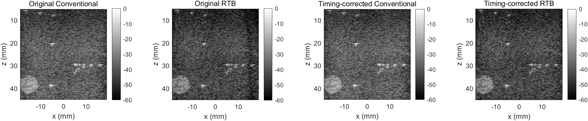
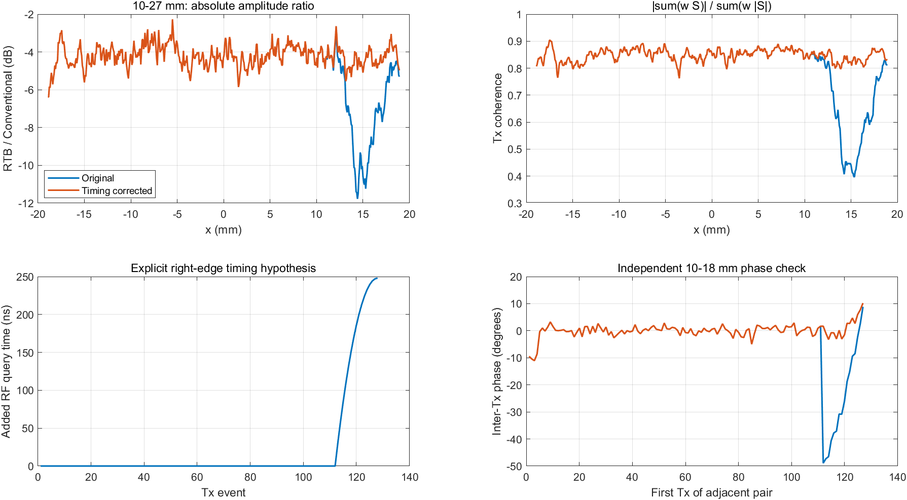
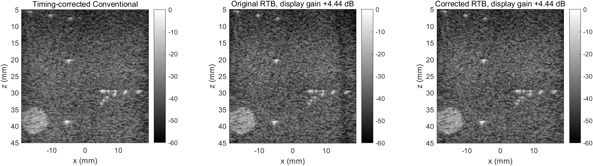

# RTB 右侧暗带调查与 RF 时间修正

2026-10-01，本地 MATLAB R2021b，USTB commit
`86126eb7cab8b6009d14f2d448e85eeb8a86f61c`。
输入：`data/L7_FI_Verasonics_CIRS_points.uff`，第一帧，1920×128×128 RF；
fs≈20.8333 MHz，c=1540 m/s，焦深≈29.5699 mm，pitch≈0.298 mm。
数据 SHA256：`0A82B703D8CA453672730AA9FE4385E5F39672B6395D65FA918358EF93F1C501`。

## 结论

原始 RTB 在右侧有 Conventional 之外的额外相干损失。
“Conventional 右侧也变暗，所以不是 RTB 问题”的推断不成立。
不同 Tx 时间参考的不一致，对一 Tx 一 scanline 的 Conventional 影响较隐蔽，
但会在跨 Tx 相干叠加的 RTB 中产生明显抵消。

本次检验了一个显式几何假设：右侧发射孔径截断后，以末端有效阵元为参考的
时间零点改变，但 UFF 的所有 `wave.delay` 为 0，没有表达这段变化。
给 RF 查询时间增加相应的每 Tx 偏移，可以恢复右侧相干度和背景幅度。
这一步不改变 Tx/Rx 权重、不旋转最终图像相位、不施加横向补亮。

**修正效果已验证；具体采集/转换机制仍是推断。** 文件中的实际
Tx apodization 读为 NaN，未取得原始 Verasonics setup，因此不能把 16 pitch
半孔径和末端阵元时间参考说成已确认的采集配置。该假设不会自动应用到其他文件。

## 实测

512×512 grid，z=5–45 mm，Rx boxcar F#=1.7，Blended p=0.5，
Tx F#=2、Tukey25、minimum aperture=3 mm、Tx 权重平均。
统计 z=10–27 mm；每个 x 区间宽 2 mm；比较区域 envelope 的 median，
Conventional envelope 仅为统计插值到同一横向 grid。
RTB/FI 比使用未经独立峰值或中心归一化的绝对幅度。

| x 区域中心 | 原始 RTB/FI | 修正 RTB/FI | 原始 Tx coherence | 修正 Tx coherence |
|---|---:|---:|---:|---:|
| −16 mm | −4.532 dB | −4.532 dB | 0.818 | 0.818 |
| −2 mm | −4.353 dB | −4.353 dB | 0.844 | 0.844 |
| +15 mm | −10.146 dB | −4.391 dB | 0.442 | 0.829 |

`Tx coherence = abs(sum(w*S)) / sum(w*abs(S))`，仅为诊断量，不参与加权。
第 1–112 次 Tx 偏移为零，第 113–128 次 Tx 修正，最大约 248.014 ns。
右侧额外损失恢复约 5.75 dB。

只换 spherical/hybrid delay，右侧仍约 −11.06 dB；
只把 Tx F# 从 2 改到 3/4，右侧仍约 −9.01/−9.30 dB。
因此没有用调整孔径或 delay-model 标签代替时间参考检查。

修正后整体仍比 Conventional 低约 4 dB。当前 RTB 对多个 Tx 的复杂信号
按权重平均，Conventional 使用自身发射中心线；两者的照射幅度和相干统计
不同，不能要求未经标定的 envelope 数值相同。统一的显示增益可以匹配
背景亮度，但不应改写 RF 重建幅度，也不能作为空间补偿。





下面仅为视觉对照：原始和修正 RTB 使用**同一个**标注的全局显示增益，
以修正结果中心背景匹配 Conventional；这不会消除原始右侧低谷。
保存的 envelope 仍是未乘显示增益的数值。



## 验证与限制

- 零偏移时，新核心的 RTB/Conventional 复数输出与修改前真实数据结果一致，
  最大绝对差小于 1e−12。
- 合成点靶分别注入 0/40/80 ns 偏移；修正恢复了相干幅度，
  非有限偏移被拒绝。测试入口：`test_rtb_tx_timing.m`。
- 几何偏移未由下面的 RF 相位测量拟合；在三个独立深度段进行前后测量。
  右侧 Tx 112–127 相邻对的相位偏差绝对值中位数：

| 深度 | 原始 | 修正 |
|---|---:|---:|
| 10–18 mm | 28.455° | 2.713° |
| 22–27 mm | 19.536° | 8.378° |
| 34–42 mm | 17.552° | 8.455° |

- 深部仍有约 8° 残差；近焦点的真实波场不能由这个常量时间偏移完全描述。
- 中心孤立点靶峰值及坐标不变。右侧近焦点的强回波峰值提升约 1.49 dB，
  在搜索窗口内的峰值坐标也改变（约 [15.961,29.814]→[16.331,29.344] mm）。
  此处有相邻目标，缺少真实坐标，不能据此断言空间位置更准确。
- `checkcode` 未报告新增诊断/偏移模型文件的问题；两个旧核心有原有未使用
  `N_samples` 和可选 inspect-map 预分配提示，未改动无关逻辑。
- 旧 edge diagnostic 的每图峰值归一化已改为共享幅度参考；
  中心对齐趋势仍保留，另加绝对 RTB/FI 比，避免掩盖整体幅度差。

## 复现与使用

在 MATLAB 中：

```matlab
addpath(genpath('D:/USTB'));
cd('D:/Ultrasound_Beamforming_Learning/matlab/01_DAS_Real_UFF');
filename = '../../data/L7_FI_Verasonics_CIRS_points.uff';
diagnose_rtb_tx_timing
test_rtb_tx_timing(filename)
```

工作区的 `rtb_corrected` / `conv_corrected` 已是修正结果。
`tx_time_offsets` 单位为秒，按原始 sequence 顺序；对其他重建参数：

```matlab
opts = rtb_corrected.options;
opts.tx_time_offsets = tx_time_offsets;
result = reconstruct_fi_rtb_manual(filename,opts);
```

也可在同一工作区运行 `diagnose_rtb_edge_darkening`，该脚本会保留并使用
`tx_time_offsets`，且把同一向量传给 Conventional 对照。
`compare_conventional_vs_rtb` 同样保留并将该向量传给两种重建。
默认核心的 `tx_time_offsets=[]`，原有 USTB 对照行为保持不变。

`timing_results.mat` 保存原始/修正重建、偏移和指标；
`timing_regions.csv`、`timing_phase.csv` 保存统计；`tests.log` 保存实际检查结果。

参考实现：[USTB DAS 源码](https://github.com/unioslo/USTB/blob/master/%2Bmidprocess/das.m)。
其中 Tx delay 由虚拟源路径、声速及 `wave.delay` 定义；复制该数学实现并与
USTB 对齐，并不能证明 UFF 记录了实际采集的每次发射时间基准。
