# 第 1 章：真实 UFF 上的 conventional FI-DAS 与 RTB

第 0 章用一个理想点目标解释了“按传播时间取样，再相干求和”。本章把同一条思路放进真实聚焦发射数据：先得到一张可以核对的 conventional FI-DAS 图，再学习怎样用 RTB 让同一次发射参与更多像素的重建。

学完后，你应该能解释一张图从哪里来，能把延时公式对应到 MATLAB 变量，也能判断图像变化来自传播模型、孔径、采样还是显示方式。

## 阅读地图

| 阶段 | 阅读范围 | 要回答的问题 | 先运行哪个入口 |
|---|---|---|---|
| A：读懂数据 | 第 1–6 节 | 我拿到什么信号？某个像素该去哪里取样？ | `inspect_uff_metadata_ustb` |
| B：完成一发一线 | 第 7–11 节 | 怎样形成图像，并量化一个点状目标？ | `das_fi_scanline_manual` |
| C：理解 RTB | 第 12–17 节 | 一次发射如何服务多个像素？怎样跨发射相干组合？ | `compare_conventional_vs_rtb` |
| D：核对与实验 | 第 18–23 节 | 与 reference 差多少？一次改一个参数能学到什么？ | `validate_manual_rtb_vs_ustb` |

第一次阅读先完成 A、B，再进入 RTB。配套代码见 [MATLAB 第一章说明](../../matlab/01_DAS_Real_UFF/README.md)。概念插图使用 AI 生成；数据图、剖面和定量曲线由 MATLAB 生成。全部原图与复现方法见 [配图与课件索引](figures/README.md)。

### 先统一几个词

| 词 / 符号 | 本章中的意思 |
|---|---|
| FI：Focused Imaging | 使用聚焦发射的数据采集方式 |
| Tx / wave，索引 $t$ | 一次发射事件；不是一个接收阵元 |
| Rx / channel，索引 $m$ | 一个接收通道的时间序列 |
| scanline | 图像里沿深度方向的一列 |
| pixel，$P=(x,z)$ | 当前要检验的候选成像位置 |
| focus / virtual source，$F_t$ | 描述聚焦发射的参考位置；不代表这里一定有散射体 |
| support | 当前模型允许某次 Tx 参与重建的像素范围 |
| RTB | Retrospective Transmit Beamforming，回顾性发射波束合成 |
| analytic RF | 带载频的复数解析信号，保留幅值与相位 |
| envelope | 解析信号的幅值，用于后续 B-mode 显示 |

本文用 $x_m$ 表示阵元横坐标，用 $v_{m,t}(\tau)$ 表示第 $t$ 次发射、第 $m$ 个接收通道的时间信号，避免把“位置”和“波形”写成同一个符号。计算内部使用 m、s、Hz，图中通常显示 mm、µs、MHz。

---

## 1. 默认教学数据：一次聚焦发射，到底记录了什么？

统一使用 `data/L7_FI_TheGB.uff`。它包含多次 focused transmit 的原始 channel data，适合把 conventional FI 与 RTB 放在同一份采集数据上学习。下载链接和 MD5 见 [数据说明](../../data/README.md)。

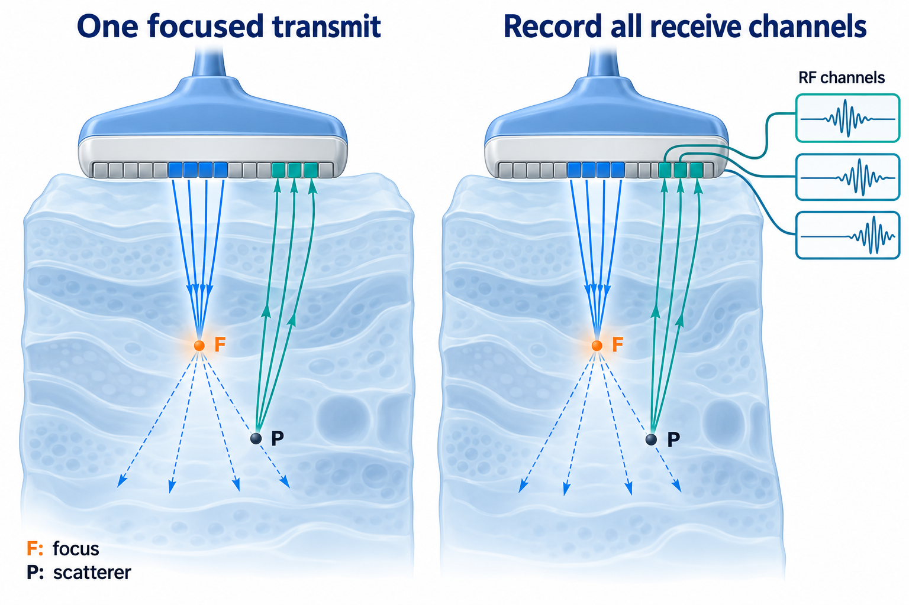

**图 1｜一次 Tx，会留下很多条 Rx 波形。** 蓝色表示发射传播，青色表示回波接收。$F$ 是发射焦点，$P$ 才是散射体。同一个 $P$ 的回波沿不同接收路径到达阵元，因此记录下来的时间序列不同。图为概念插画，不按比例；少量阵元仅用于示意。

采集完成以后，我们已经拥有这些波形。重建要做的是：**假设某个像素有散射体，预测每条波形中的对应时刻，取出样本并检查能否相干相加。**

> 课件提问：Tx 焦点与图像中的亮点为什么不是同一个概念？答：前者由发射设置决定，后者来自散射回波和重建结果。

## 2. USTB 与本项目分别做什么？

USTB 负责读出 UFF 对象、探头坐标和发射信息，并提供对照实现。本项目显式计算 Tx/Rx delay、插值、孔径、DAS、RTB 的 Tx 权重及跨 Tx 组合。

进入核心函数后，你能逐步看到从空间位置到查询时间，再到复数图像的计算：

~~~mermaid
flowchart LR
    A[UFF 与 metadata] --> B[Tx 和 Rx 查询时间]
    B --> C[通道插值]
    C --> D[接收相干求和]
    D --> E[Conventional 图像]
    D --> F[RTB 跨 Tx 相干组合]
    E --> G[包络和 dB]
    F --> G
~~~

## 3. 先确认 data contract

在仓库根目录打开 MATLAB，设置 USTB 路径，然后进入本章代码目录：

~~~matlab
addpath(genpath('D:/USTB'));  % 换成自己的 USTB 路径
cd matlab/01_DAS_Real_UFF
filename = '../../data/L7_FI_TheGB.uff';
inspect_uff_hdf5
inspect_uff_metadata_ustb
plot_raw_channel_overview_ustb
~~~

这些入口会清理部分工作区变量；建议用独立 MATLAB 会话学习。先看数据报告，再写延时。

### 3.1 四个维度，不要把 Tx 与 Rx 混起来

~~~matlab
channel_data.data(sample, channel, wave, frame)
%                  时间      Rx       Tx     帧
~~~

本次对默认文件的实际读取结果为：

| 项目 | 本次读取值 | 为什么要看 |
|---|---:|---|
| shape | `[1920,128,128,1]` | 1920 个样本、128 Rx、128 Tx、1 帧 |
| dtype / real | `single` / 实数 | 本章输入为 RF |
| sampling frequency | 20.833334 MHz | 延时如何映射到样本 |
| initial time | 0 s | 第一个样本对应的记录时间 |
| sound speed | 1540 m/s | 距离如何转换成时间 |
| modulation frequency | 0 Hz | 与实数状态一起确认 RF 语义 |
| pulse center frequency | 5.2083335 MHz | 采样误差对应的载波相位 |
| pitch | 约 0.298 mm | 阵列空间采样 |
| Rx 阵元中心范围 | 约 −18.923 到 +18.923 mm | 接收几何与最大孔径 |
| Tx focus depth | 约 29.568 mm | 焦点前后的发射模型 |
| `wave.delay` 范围 | 约 −1.895 到 +1.699 µs | 各次发射的时间参考并不相同 |

数值来自本次本地 UFF 读取，完整记录见 [MATLAB 运行输出](figures/matlab_all_results.txt)。

~~~matlab
rf_wave = channel_data.data(:,:,64,1);  % [1920,128]
trace = channel_data.data(:,32,64,1);   % [1920,1]
~~~

第一句取出一次发射的所有 Rx 通道；第二句只取其中一个通道。128 Rx 与 128 Tx 在这里恰好相等，物理意义仍完全不同。

### 3.2 先看通道图，再看图像

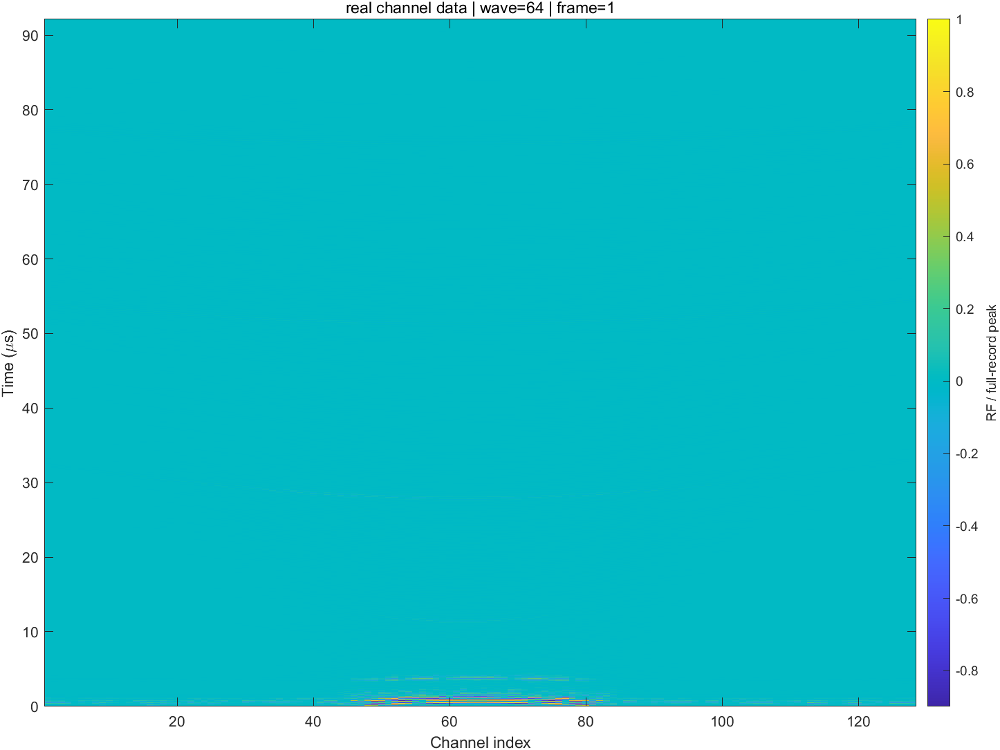

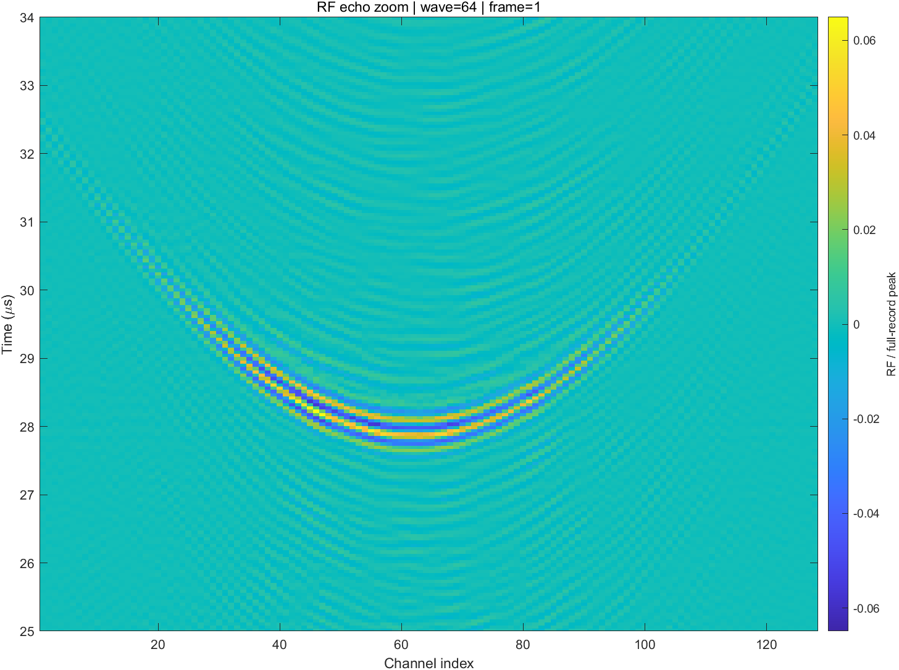

**图 2｜横轴是 channel，纵轴是记录时间。** 上图看完整记录，下图放大时间范围并缩窄对称色限，让较弱回波可见；色条都以完整记录峰值为单位，保留 RF 正负号。很早时刻的强信号压低了上图中较晚回波的颜色对比。它们还不是 B-mode 图。真实数据包含许多散射体与背景回波，因此整张图不会只有第 0 章那样的一条干净轨迹。

原始通道图使用 `axis xy`，时间向上增加；后面的 B-mode 图使用深度向下的显示方式。读图时先确认坐标轴。

### 3.3 时间轴与 wave.delay，只用一套约定

本项目使用不含逐 Tx 偏置的公共记录时间轴：

$$ t[n]=t_0+\frac{n-1}{f_s},\qquad n=1,\ldots,N_{\mathrm{samples}}. $$

USTB 的 `channel_data.time(t)` 已经包含该次发射的 `sequence(t).delay`。两种约定都可以一致使用：

| 记录时间轴 | 几何查询时间 | 用法 |
|---|---|---|
| $t_0+(n-1)/f_s$ | $\tau_{\mathrm{geom}}-\mathrm{wave.delay}$ | 本章 Manual core |
| $t_0+(n-1)/f_s+\mathrm{wave.delay}$ | $\tau_{\mathrm{geom}}$ | 使用逐 wave 的 USTB 时间轴 |

选择第一行时，在查询时间里减 `wave.delay`；选择第二行时不再重复减。两行最终查到同一个样本位置。

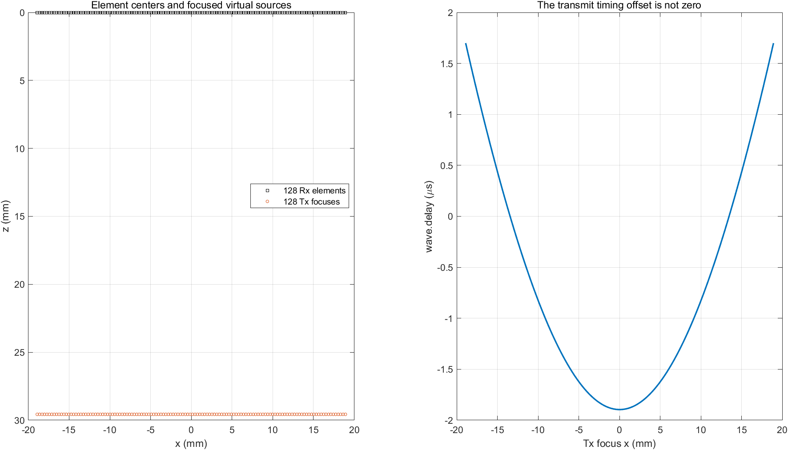

**图 3｜几何和时间偏置都要实际读取。** 左图显示探头与焦点位置，右图显示 `wave.delay` 随 Tx 的变化。偏置达到微秒量级，远大于一个 RF 周期；忽略它会明显改变取样位置。

## 4. Focused transmit：为什么焦点前减，焦点后加？

对当前 Tx，记焦点为 $F=(x_f,z_f)$，候选像素为 $P=(x,z)$：

$$ d_F(P)=\sqrt{(x-x_f)^2+(z-z_f)^2}. $$

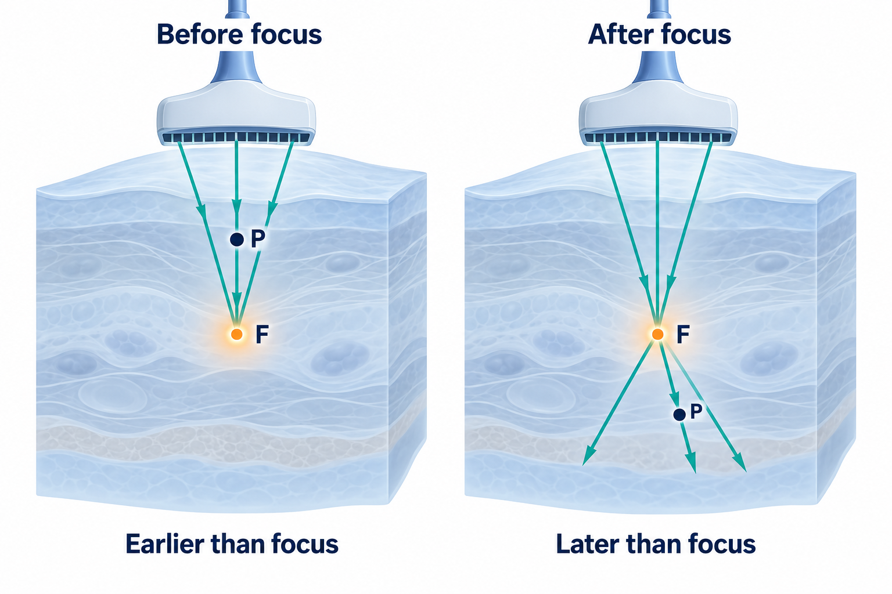

**图 4｜以“到达焦点的时间”作参考。** 左侧声波先经过 $P$ 再到 $F$，所以 $P$ 比焦点更早被经过；右侧位于焦点后的像素，传播时间要再增加。减号表示更早的时刻，声波始终向深处传播。图为概念示意。

在本章的 spherical 约定下：

$$ d_s(P)=\begin{cases}-d_F(P),&z<z_f,\\+d_F(P),&z\ge z_f.\end{cases} $$

$$ \boxed{\tau_{\mathrm{Tx}}(P)=\frac{R_f+d_s(P)}{c_t}-\mathrm{wave.delay}},\qquad R_f=\mathrm{wave.source.distance}. $$

$c_t$ 对应 `wave.sound_speed`；本次文件中它与 `channel_data.sound_speed` 都为 1540 m/s。

**source.distance 要读取，不要自行替换为 $z_f$ 或 origin-to-focus 距离。** 它是 USTB source 的参考距离；不同 Tx 的值并不完全相同。用实际元数据才能与库中的时间约定一致。

在当前垂直中心线上，焦点前后都有 $d_s=z-z_f$，所以两侧都化为：

$$ \tau_{\mathrm{Tx}}=\frac{R_f+z-z_f}{c_t}-\mathrm{wave.delay}. $$

因此中心线经过焦点时，没有这个符号规则造成的跳变。离轴像素更复杂，留到第 14 节。

## 5. Receive delay：从候选像素返回每个阵元

第 $m$ 个阵元为 $E_m=(x_m,y_m,z_m)$。本章成像平面为 $y=0$：

$$ \tau_{\mathrm{Rx},m}(P)=\frac{\sqrt{(x-x_m)^2+y_m^2+(z-z_m)^2}}{c}. $$

$$ \boxed{\tau_{m,t}(P)=\tau_{\mathrm{Tx},t}(P)+\tau_{\mathrm{Rx},m}(P)}. $$

Tx 时间对同一像素、同一次发射只需算一次；Rx 时间随阵元改变：

~~~matlab
tau_tx = ...;                       % 标量，s
tau_rx = rx_distance / sound_speed; % [1,N_channels]，s
tau_total = tau_tx + tau_rx;        % [1,N_channels]，s
~~~

对 20 mm 附近的中心目标，两段传播总时间通常在数十微秒量级。先检查数量级，再看图像；把 mm 当成 m 会立即破坏这个关系。

## 6. Fractional-sample interpolation：查询位置通常不是整数

将查询时间转换为 MATLAB 的连续样本位置：

$$ u_{m,t}=(\tau_{m,t}-t_0)f_s+1,\qquad i=\lfloor u_{m,t}\rfloor,\qquad \beta=u_{m,t}-i. $$

线性插值为：

$$ v_{m,t}(\tau_{m,t})\approx(1-\beta)v_{m,t}[i]+\beta v_{m,t}[i+1],\qquad 0\le\beta<1. $$

例如 $u=3.35$，使用第 3、4 个样本，权重为 0.65、0.35。最近邻只取第 3 个样本。

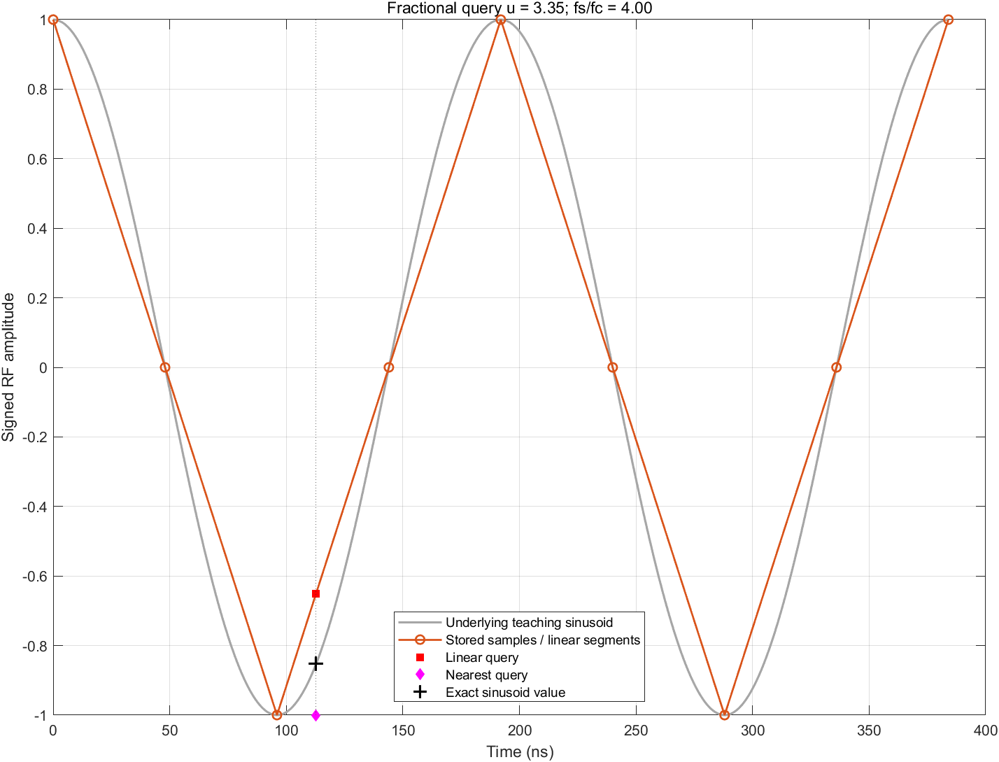

**图 5｜插值是明确的数值近似。** 灰线是已知的教学正弦波，圆点按默认数据的 $f_s,f_c$ 采样，红方块为线性查询，黑十字为精确值。线性插值避免取整，但仍可能有幅值误差。此图不是组织回波。

本数据每个载波周期约 4 个样本。一采样周期对应约 90° 相位，最近邻的半样本误差可达到约 45°，因此插值直接影响相干求和。

核心函数只对 $1\le i<N_{\mathrm{samples}}$ 的查询取样，其余返回零并取消对应接收权重。`n_out_of_range / n_requested` 用来判断是否大量查询落在记录之外。零值不能代替正确的时间模型。

### 把第 4–6 节连成一个数值例子

取本次文件的 wave 64，在它的中心线上查询一个深度 20 mm 的候选像素，并使用附近的 Rx 64。以下数值按实际 metadata 四舍五入：

| 步骤 | 代入 / 结果 | 对应代码 |
|---|---|---|
| 焦点与时间参考 | $x_f\approx-0.14899$ mm，$z_f\approx29.568$ mm；$R_f\approx29.568376$ mm；`wave.delay` 约 −1.895459 µs | `wave.source`、`wave.delay` |
| Tx 查询时间 | $\tau_{\mathrm{Tx}}\approx14.883$ µs；焦点前用负距离，最后减去负的 `wave.delay` | `tau_tx` |
| Rx 返回时间 | Rx 64 与像素几乎同一横坐标，$\tau_{\mathrm{Rx}}\approx\frac{20\times10^{-3}\ \mathrm{m}}{1540\ \mathrm{m/s}}\approx12.987$ µs | `tau_rx` |
| 总查询时间 | $\tau\approx27.870$ µs | `tau_total` |
| 连续样本位置 | $u\approx581.62$，不是整数 | `(tau_total-t0)*fs+1` |
| 插值 | 第 581、582 个样本的权重约为 0.38、0.62 | `i`、`beta` |

这个例子只算了一个像素、一个通道。对其余 Rx 重复并相干求和，才得到该像素；对更多深度重复，才得到整条 scanline。查询时间落在图 2 的放大范围内，你可以先在那里找对应的 RF 振荡。

## 7. Conventional FI-DAS：一个 Tx 重建一条线

当前输出横坐标取 `sequence(t).source.x`。第 $t$ 次 Tx 重建自己的中心线，在每个深度查询有效 Rx：

$$ s_{m,t}(P)=v_{m,t}\!\left(\tau_{m,t}(P)\right),\qquad y_t(P)=\sum_{m=1}^{M}w^{\mathrm{Rx}}_m(P)s_{m,t}(P). $$

运行 `das_fi_scanline_manual`。核心是 [reconstruct_fi_scanline_manual.m](../../matlab/01_DAS_Real_UFF/reconstruct_fi_scanline_manual.m)，数据流为：

~~~matlab
rf_wave          % [sample,Rx]，实数 RF
analytic_wave    % [sample,Rx]，复数解析 RF
tau_total        % [1,Rx]，查询时间
focused_samples  % [1,Rx]，插值后的复数观测
weights          % [1,Rx]，接收权重
% sum(weights .* focused_samples) -> 一个复数像素
~~~

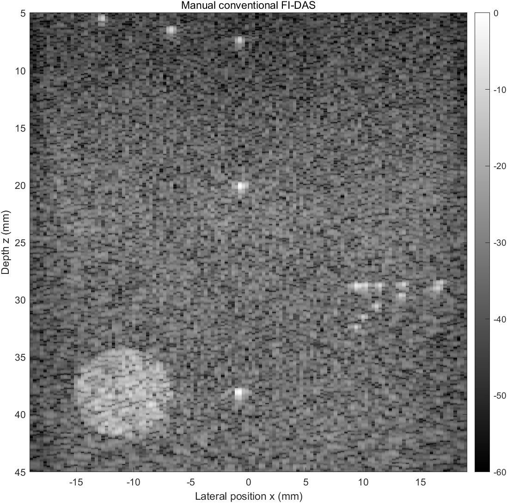

**图 6｜第一次把真实 RF 变成 B-mode。** 深度向下，横轴为成像位置，色条为相对全图峰值的幅值 dB，显示范围 −60 到 0 dB。先找点状亮目标，再看背景和其他结构。传播模型、孔径与显示共同影响结果。

默认入口使用 full Rx aperture，横向有 128 条 scanline。输出 `das_analytic`、`envelope`、`image_db` 的 shape 都是 `[z,scanline]`，但对应不同处理阶段。

## 8. Analytic RF、envelope 与 dB：顺序要讲清楚

本章沿时间维用 FFT 构造解析信号：保留 DC，正频率加倍，负频率置零；偶数长度时保留 Nyquist 项。这样无需调用 `hilbert`：

$$ v_a(u)=v(u)+j\mathcal H\{v(u)\}. $$

解析 RF 仍带载频，不是已解调的基带 IQ。相干求和完成后才取包络：

$$ A(P)=|y_a(P)|,\qquad I_{\mathrm{dB}}(P)=20\log_{10}\frac{A(P)}{A_{\mathrm{ref}}}. $$

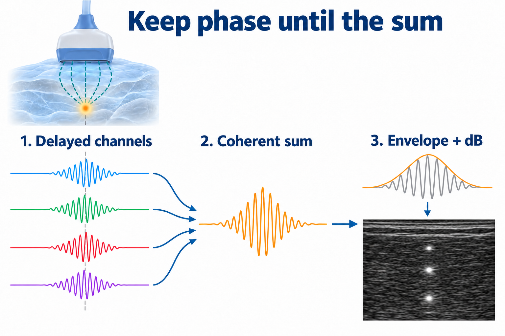

**图 7｜保留符号与相位，相加以后才取幅值。** 左侧通道仍有正负振荡，中间相干叠加，右侧才取包络与显示。AI 插画中的缩略图只表示处理终点，真实结果以图 6 为准。

逐通道先 `abs` 再求和会丢失相消信息。跨 Tx 组合前也应保留复数相位。例如观测为 $1$、$-1$，相干和为 0，先取幅值的和为 2。

比较图像时说明 $A_{\mathrm{ref}}$：

- 各自峰值归一化：比较形状，隐藏整体增益差。
- 公共峰值归一化：比较相对幅值，仍受色条和 clipping 限制。
- 局部 PSF：剖面以该目标峰值归一化，在未裁剪的线性包络上测宽。

## 9. Conventional DAS reference validation

运行 `validate_manual_vs_ustb`。它匹配数据、frame、网格、spherical Tx、full Rx aperture 与 MATLAB 插值路径。

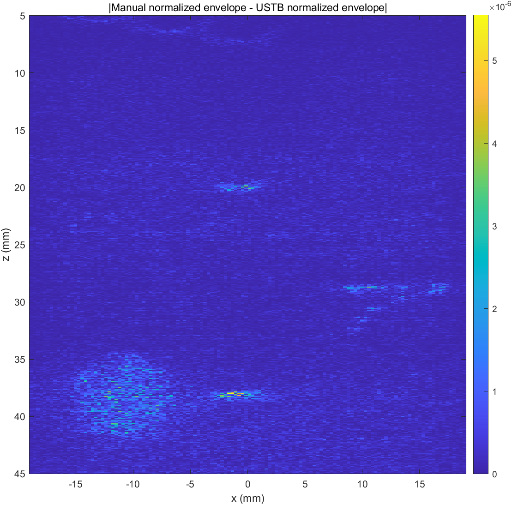

**图 8｜并排图看结构，差异图找偏差。** 差异图显示线性包络绝对差，不是 dB。要看色条数值，不能只凭色彩深浅判断误差。

脚本打印 correlation、normalized MAE / RMSE、最大误差和峰位置。相关性高不等于处处相同，各自归一化也会消除整体比例差，指标需要一起解释。RTB 有自己的对照，conventional 的对照结论不能直接推广过去。

本次 `[512,128]` 网格得到包络相关系数 **0.999999583**、归一化 RMSE **$2.73\times10^{-7}$**、最大绝对差 **$5.55\times10^{-6}$**，两者全局峰位置相同。这支持当前数据和匹配条件下的实现一致性。运行环境与完整指标见配图索引。

## 10. Point-target PSF：同一目标，两个方向

运行 `analyze_point_target_psf`，先选择相对孤立的点状目标，脚本在附近找局部峰。本次检查图 6 后，选择约 $(-0.75,20.05)$ mm 作为搜索起点。可以非交互复现：

~~~matlab
target_x_mm = -0.75;
target_z_mm = 20.05;
analyze_point_target_psf
~~~

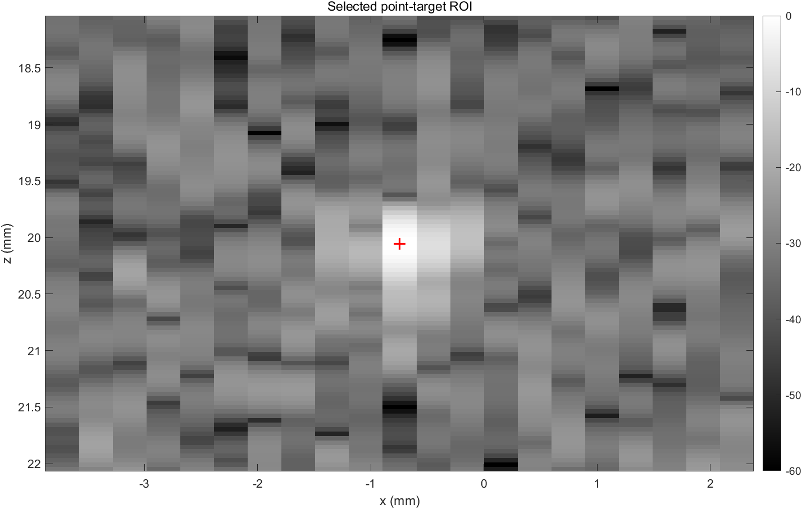

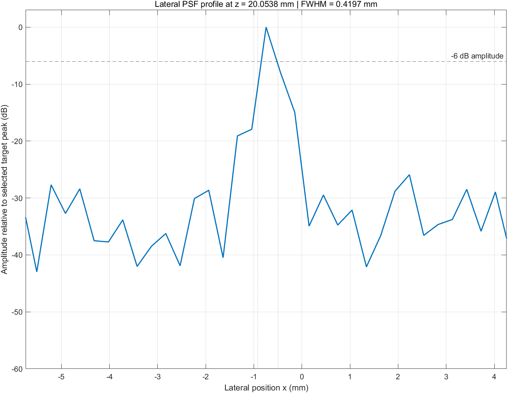

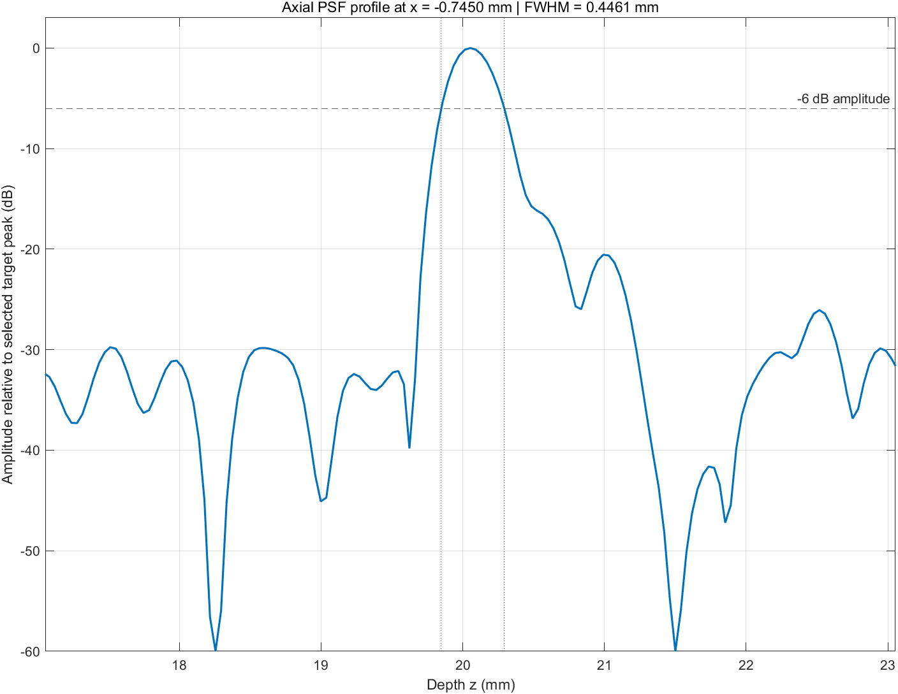

**图 9｜先看目标，再看穿过峰的两个剖面。** 横向剖面改变 $x$，轴向剖面改变 $z$；轴向图的横轴画的是深度。−6.0206 dB 虚线对应幅值 0.5，竖线标出半幅交点。

本次 full-aperture、1024 深度点结果：

| 量 | 本次值 | 解读 |
|---|---:|---|
| 局部峰 | $x\approx-0.745$ mm，$z\approx20.054$ mm | 图像峰，不是独立物理真值 |
| 横向步长 | 0.297981 mm | conventional scanline 间距 |
| 轴向步长 | 0.039101 mm | 重建深度网格 |
| 横向半幅宽度 | 约 0.4197 mm | 仅跨约 **1.41** 个横向间隔，受采样强烈限制 |
| 轴向半幅宽度 | 约 0.4461 mm | 跨约 **11.41** 个深度间隔，采样相对充足 |

本次分析没有使用独立的 phantom point ground truth，所选亮点也未被校准为理想点散射体。这里测的是所选 point-like object 的图像响应，真实目标尺寸、背景和系统响应都会影响宽度。

**很多小数位不代表高精度。** 用交点插值能给出宽度，却不能补回粗采样丢失的形状。幅值 FWHM 是 −6.02 dB；功率减半是 −3.01 dB，定义要写清。

## 11. Receive F-number：哪些接收阵元参与这个像素？

运行 `compare_receive_aperture_full_vs_fnumber`，只改变 Rx aperture：

$$ F\#_{\mathrm{Rx}}=\frac{z}{D_{\mathrm{Rx}}},\qquad D_{\mathrm{Rx}}(z)=\frac{z}{F\#_{\mathrm{Rx}}}. $$

选择满足 $|x_m-x|\le D_{\mathrm{Rx}}/2$ 的阵元。固定 F-number 时，浅层阵元较少，深层更多，最后受阵列边界限制。

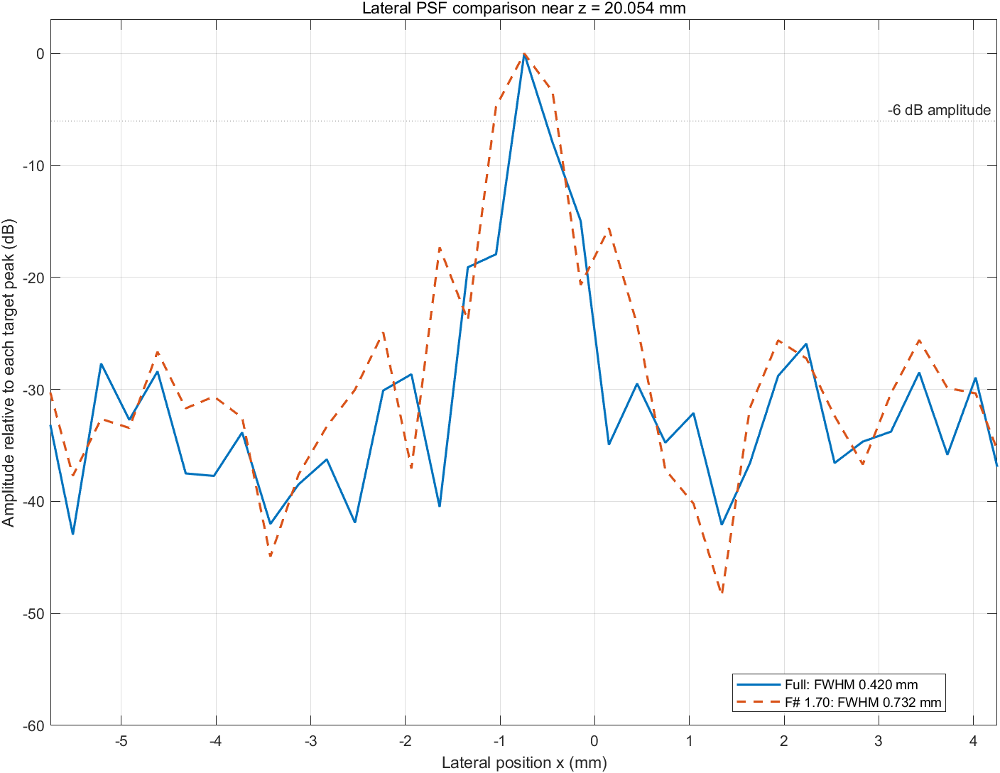

**图 10｜比较同一目标的主瓣与两侧响应。** 剖面各按自己的目标峰值归一化。一般而言，减小有效孔径会展宽横向主瓣；真实背景、Tx 声场与粗采样也会影响本次曲线。

代码使用 boxcar Rx 权重，Rx sum **没有除以有效阵元数**。孔径改变也会改变幅值，不能把各自归一化的图解读为绝对增益相同。`active_channel_count` 用于核对每个像素用了多少 Rx。

---

## 12. RTB：一发多像素，多发同像素

RTB 回到 raw channel data，让一个 Tx 在其 support 内重建多个像素，并让多个 Tx 对同一像素的结果相干组合。

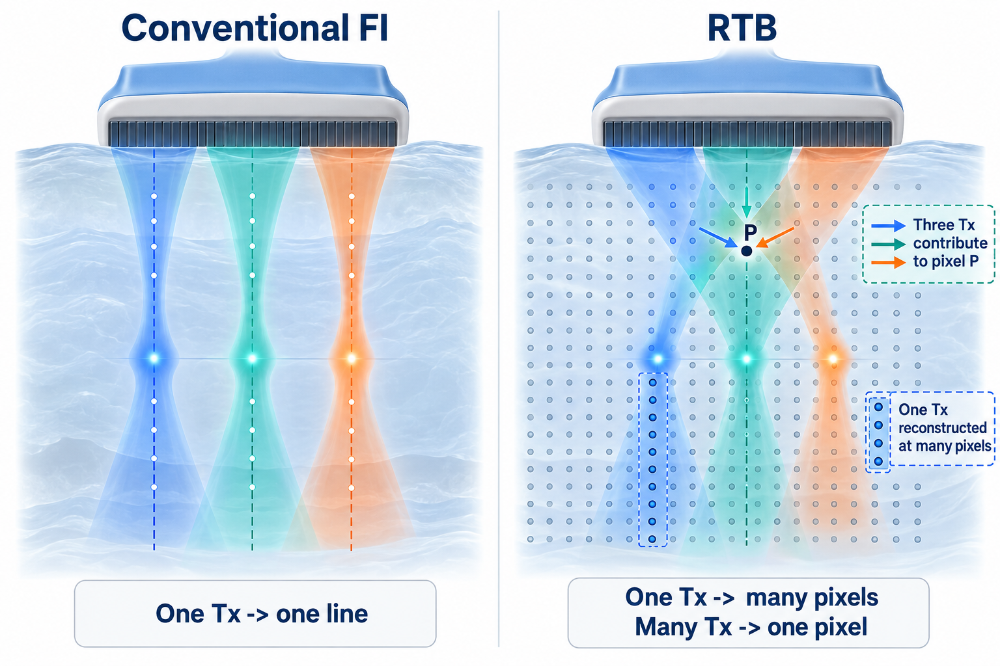

**图 11｜变化发生在“如何使用已有 Tx 数据”。** 左侧只画中心线输出；右侧画密网格，同一像素 $P$ 接收不同 Tx 的贡献。彩色箭头表示计算关系，不是声波在组织里改变方向。具体 support 见第 15 节。

每次 Tx 先完成接收 DAS：

$$ S_t(P)=\sum_m w^{\mathrm{Rx}}_m(P)s_{m,t}(P). $$

保留相位，跨 Tx 加权：

$$ S_{\mathrm{RTB}}(P)=\frac{\sum_t w^{\mathrm{Tx}}_t(P)S_t(P)}{\sum_t w^{\mathrm{Tx}}_t(P)}. $$

分母为零时，代码令输出为零。沿 Rx 的组合仍是 DAS，新增的是 pixel-based Tx 几何、support 和跨 Tx 相干组合。

这还要求 Tx 之间的目标运动和时间参考不会造成无法忽略的相位不一致。本章对所选帧做静态重建，没有运动补偿；运动场景需要重新评估。

## 13. RTB 与图像插值，各在哪里增加像素？

运行 `compare_conventional_vs_rtb`：

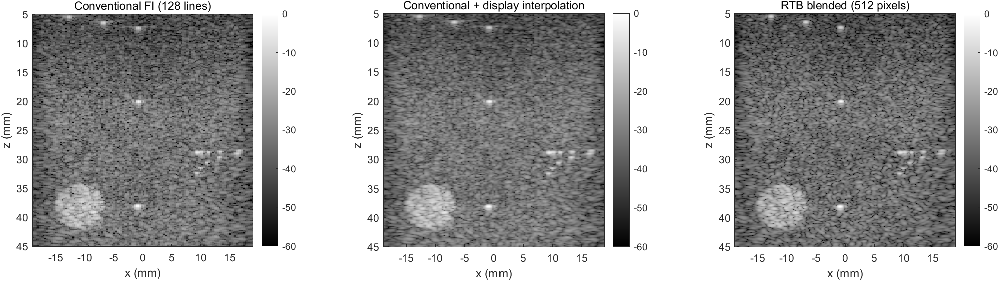

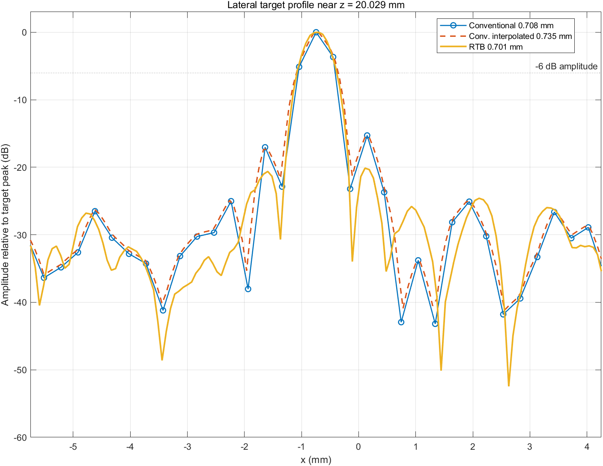

**图 12｜看数据入口，再看显示是否平滑。** 第一张是 scanline 输出；第二张对已形成的 conventional **包络**做横向插值；第三张重新查询 RF 并计算新像素的 Tx/Rx delay。三者保持相同 Rx F-number，图像各按自身峰值归一化。

| 操作 | 重新访问 RF | 新像素传播时间 | 新增跨 Tx 相干组合 |
|---|---|---|---|
| conventional 包络插值 | 否 | 否 | 否 |
| RTB | 是 | 是 | 是 |

默认 128 条 conventional 线、512 个 RTB 横向像素，覆盖相同范围。像素更多意味着输出采样更密，**不会自动证明物理分辨率提升**。同时看目标响应、采样、旁瓣与背景。

## 14. RTB 的新增难点：离轴像素的 Tx delay

一个 Tx 现在要解释周围像素：除了深度，还要考虑偏离中心线的距离。三种模型都在回答这个传播时间问题。

### 14.1 Spherical：焦点参考与离轴符号跳变

spherical path 为第 4 节的 $L_{\mathrm{sph}}=R_f+d_s(P)$。中心线上等价于 $R_f+z-z_f$。离轴时，在焦深两侧的极限不同：

$$ L_{\mathrm{sph}}(z_f^-)=R_f-|x-x_f|,\qquad L_{\mathrm{sph}}(z_f^+)=R_f+|x-x_f|. $$

$$ \Delta\tau_{\mathrm{jump}}=\frac{2|x-x_f|}{c_t}. $$

横向偏离 1 mm、声速 1540 m/s 时，跳变量约 1.30 µs。这是简化模型的符号切换；真实声场不会因像素越过一个深度平面就突然跳变。

### 14.2 Plane：用轴向参考绕开这个跳变

当前 linear scan 的局部 plane path：

$$ L_{\mathrm{plane}}(P)=R_f+z-z_f. $$

同一深度得到相同 Tx 时间。它在焦区提供另一种近似，绕开上述正负切换；全图采用则忽略离轴曲率。

不能用“焦点附近球面很大，因此很平”解释它。几何球面靠近球心时曲率反而很大；这里是**焦区传播的近似模型**，需要数据与参考评估。

### 14.3 Blended：先看权重究竟怎么计算

本仓库与本次 USTB 版本使用：

$$ \rho(P)=\sqrt{x^2+z^2},\qquad q(P)=\min\!\left(\frac{|R_f-\rho(P)|}{R_f},1\right),\qquad \alpha(P)=q(P)^p. $$

$$ L_{\mathrm{blend}}(P)=\alpha(P)L_{\mathrm{sph}}(P)+[1-\alpha(P)]L_{\mathrm{plane}}(P). $$

$$ \tau_{\mathrm{Tx}}(P)=L_{\mathrm{blend}}(P)/c_t-\mathrm{wave.delay}. $$

~~~matlab
pixel_radius = sqrt(x.^2 + z.^2);
q = min(abs(wave.source.distance - pixel_radius) ...
    / wave.source.distance, 1);
alpha = q .^ opts.blending_power;
path_length = alpha .* spherical_path + (1-alpha) .* plane_path;
~~~

默认 $p=0.5$。$\alpha$ 小时 plane 更重要，$\alpha$ 大时 spherical 更重要。**权重依赖全局原点距离 $\rho$，并非只依赖 $|z-z_f|$ 或 pixel-to-focus 距离。** 公式依据 [对应版本的 USTB DAS 源码](https://github.com/unioslo/USTB/blob/86126eb7cab8b6009d14f2d448e85eeb8a86f61c/%2Bmidprocess/das.m)。

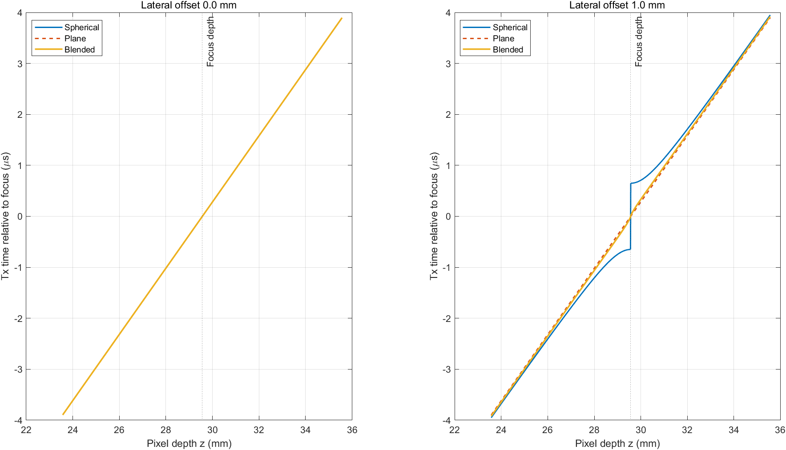

**图 13｜先看左侧重合，再看右侧差异。** 纵轴减去共同的焦点参考时间。中心线上三条曲线重合；横向偏离 1 mm 时，spherical 有明显跳变，plane 没有，blended 减小了其影响。曲线来自元数据与公式，不是声场测量。

本次近中心 Tx 的 1 mm 离轴位置，spherical 极限跳变量约 **1299 ns**，blended 约 **26 ns**。后者画在微秒坐标里很小，仍不能据此把延时误差当成零。

$\alpha$ 连续变化，不代表最终延时处处连续。若焦深处 $\alpha_f\ne0$，blended 仍有 $2\alpha_f|x-x_f|/c_t$ 的极限跳变。准确说法是“用连续权重混合两种近似”，不能保证所有焦区伪影消失。

`hybrid` 则在 $|z-z_f|\le\mathrm{pw\_margin}$ 的区域直接用 plane，外部用 spherical。硬切换可能把接缝移到替换带的边界，适合与 blended 对照。

### 14.4 必跑：只换 Tx delay model

~~~matlab
compare_rtb_spherical_plane_blended
~~~

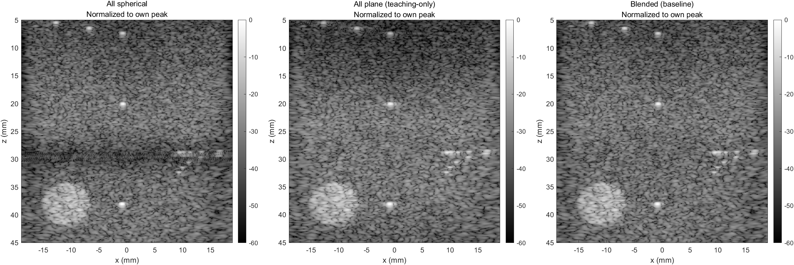

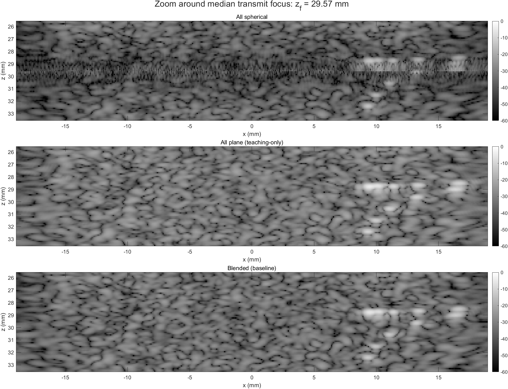

**图 14｜先看全图，再看约 29.568 mm 的焦区。** 同一数据、网格、Tx/Rx support、插值和 normalization，只改变 Tx delay model。各图按自己的峰值归一化，看形态；公共峰值图另存于配图目录，用于观察幅值差。

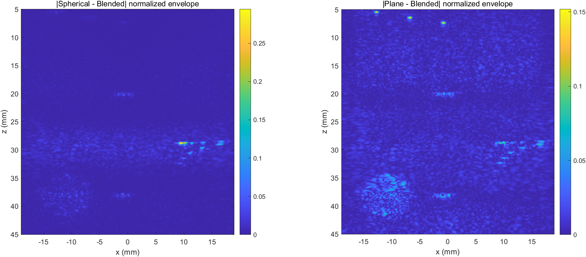

**图 15｜difference 表示模型差异，不是相对真值的误差。** Blended 这里只是比较参考。更接近 blended，不等于更接近真实声场。

> 课件提问：中心线上三种模型重合，为何整张图仍不同？答：RTB 使用离轴像素；同一像素对不同 Tx，可能各处于不同的离轴位置。

## 15. Tx support 与 Rx aperture：两个方向、两个权重

Tx support 决定**某次发射参与哪些像素**；Rx aperture 决定**一个像素采用哪些接收阵元**。

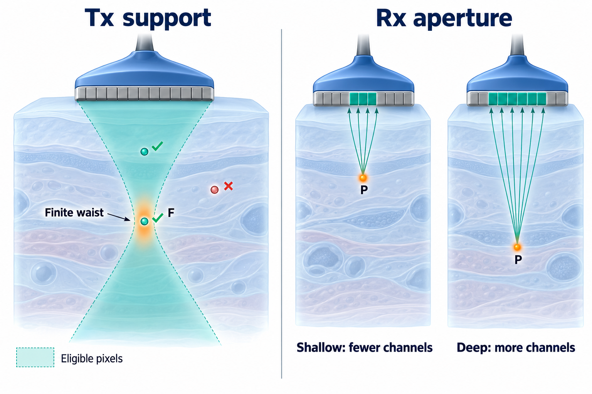

**图 16｜左侧选像素，右侧选阵元。** 有限腰部示意最小 Tx support；右图示意相同 Rx F-number 下深度增大、接收阵元增多。概念插画不代表测得的声压分布。

在以焦点为参考的 beam-local 坐标 $(x',z')$ 中：

$$ z_{\mathrm{eff}}=\max(|z'|,D_{\min}F\#_{\mathrm{Tx}}),\qquad r=\frac{F\#_{\mathrm{Tx}}|x'|}{z_{\mathrm{eff}}}. $$

boxcar 选 $r\le0.5$；`tukey25` 在中心平台之外渐变到零。完整 support 宽度：

$$ D_{\mathrm{support}}=\max\!\left(\frac{|z'|}{F\#_{\mathrm{Tx}}},D_{\min}\right). $$

`tx_min_aperture=3e-3` 表示模型中 support 的最小全宽，不能直接解释成硬件发射孔径。没有下限，几何模型会在焦点收缩到零宽度。

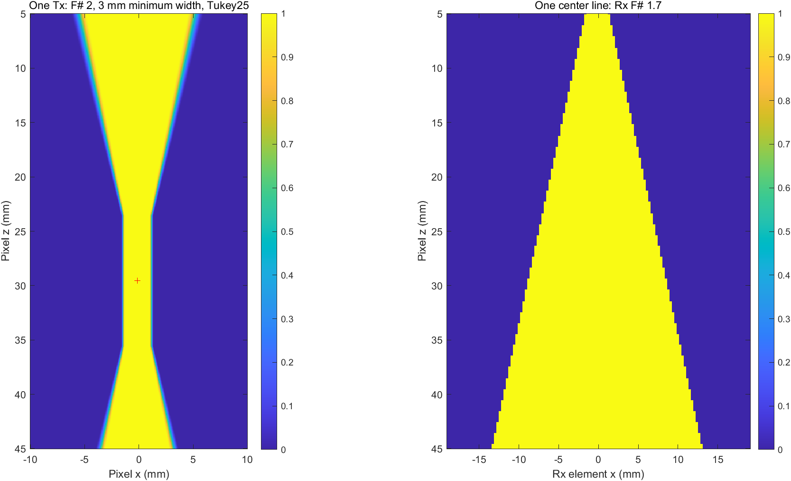

**图 17｜概念图之后，用数值图核对。** 左侧是近中心 Tx 的 Tukey 权重，右侧是中心像素线的 Rx 选择。左图横轴是 pixel 位置，右图横轴是阵元位置。相同单位，却选择不同对象。

| 参数 | 默认值 | 控制什么 |
|---|---:|---|
| `tx_f_number` | 2 | Tx support 的张开程度 |
| `tx_min_aperture` | 3 mm | 焦区 support 的最小宽度 |
| `tx_window` | `tukey25` | Tx support 边缘权重 |
| `rx_f_number` | 1.7 | 各像素接收孔径宽度 |
| `x_upsample` | 4 | 输出横向采样点数 |

support 是重建近似，并非扫描器完整声场测量。扩大 support 不会凭空产生有效照射的信息。

## 16. Tx overlap normalization：用了多少次发射？

代码累计复数贡献与权重：

$$ C(P)=\sum_t w_t^{\mathrm{Tx}}(P)S_t(P),\qquad W(P)=\sum_t w_t^{\mathrm{Tx}}(P). $$

然后用 $C/W$ 形成 RTB。若各 Tx 的相干响应近似相同，除以 $W$ 能消除重复次数引起的增益变化；若相位不一致，分母无法修复相消。

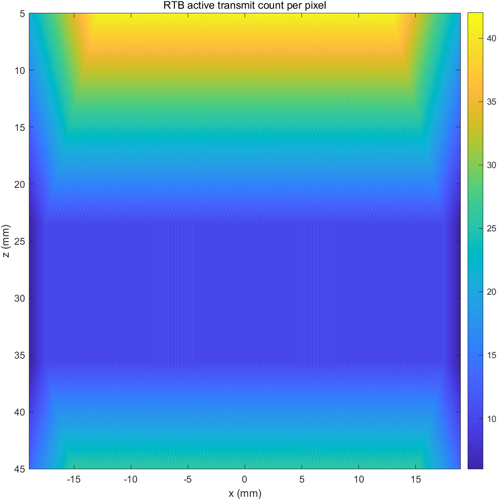

**图 18｜这是 coverage 诊断，不是 B-mode。** `active_tx_count` 数权重大于零的 Tx，`tx_weight_sum` 累计权重，两者不同。覆盖较少或权重和很小的区域值得单独检查。

归一化只处理 Tx-overlap。Rx 权重和、真实发射声压、衰减和系统增益仍影响亮度，它不是完整深度增益校正。

## 17. Manual RTB 核心：沿两个方向相干求和

核心是 [reconstruct_fi_rtb_manual.m](../../matlab/01_DAS_Real_UFF/reconstruct_fi_rtb_manual.m)，按 Tx streaming accumulation，不保存完整 `[z,x,Tx]` 立方体：

~~~matlab
for each Tx
    % [sample,Rx] -> 沿 sample 维构造解析 RF
    % 计算当前深度行的 Tx support
    % support 内计算 Tx + Rx 查询时间
    % 插值得到 samples：[active_pixel,Rx]
    single_tx_values = sum(rx_weights .* samples,2); % 沿 Rx 相加
    weighted_values = tx_weights .* single_tx_values;
    % 加入 coherent_sum
    % 累计 tx_weight_sum 与 active_tx_count
end
% 有效 pixel 除以 tx_weight_sum
% abs -> envelope -> 20log10 -> display clipping
~~~

两次相干组合：`sum(...,2)` 沿 Rx，逐次更新 `coherent_sum` 沿 Tx。两次都保留复数相位。输出 `rtb_analytic`、`envelope`、`image_db` 的 shape 为 `[z,x]`。

设置 `opts.inspect_wave_index` 可返回 `single_tx_unweighted`、`single_tx_weighted`、`single_tx_delay`。延时、权重与响应适合分开画图检查。

## 18. RTB reference validation

~~~matlab
delay_model = 'blended';
validate_manual_rtb_vs_ustb
~~~

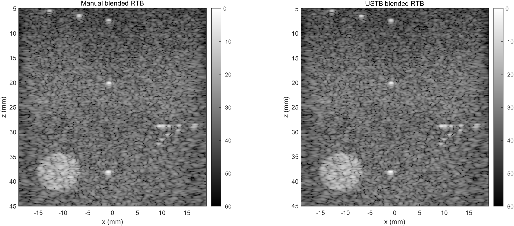

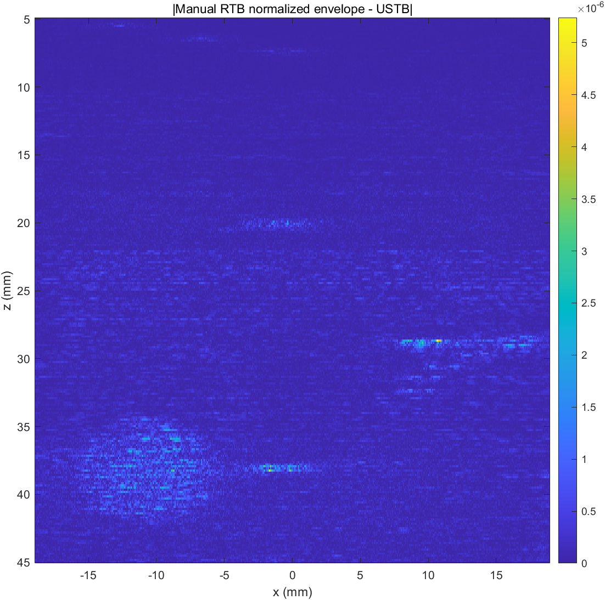

**图 19｜对照也要限定结论。** 本次匹配 x/z grid、Tx model、F-number、Tukey25、minimum aperture、Rx F-number 和 Tx normalization。指标与差异图共同描述一致程度。两个实现共享的近似，仍需要独立物理证据。

本次 `[256,512]` 网格得到包络相关系数 **1.000000000**（打印精度内）、归一化 RMSE **$2.05\times10^{-7}$**、最大绝对差 **$5.24\times10^{-6}$**，两者全局峰位置相同。较低深度采样用于实现对照，不用于本章 PSF 的精细测量。

若差异明显，先检查 wave 时间参考、Tx origin / support、apodization、插值及精度。不要用图像增强掩盖计算差异。

## 19. 单因素实验：先预测，再运行

~~~matlab
experiment = 'delay_model';
experiment_rtb_parameter_sweep
~~~

| `experiment` | 运行前写下预测 |
|---|---|
| `delay_model` | spherical / hybrid / blended 的差异集中在哪？ |
| `x_upsample` | 哪些变化只是网格采样变化？ |
| `tx_fnumber` | F-number 更大，Tx support 更窄还是更宽？ |
| `tx_min_aperture` | 最小宽度增大，焦区参与的 Tx 怎么变？ |
| `pw_margin` | hybrid 替换带扩大后，接缝可能移到哪里？ |
| `rx_fnumber` | Rx F-number 更大，孔径和主瓣怎么变？ |
| `wave_stride` | 减少 Tx 后，coverage 与相干增益怎么变？ |
| `blending_power` | $0<q<1$ 时，增大 $p$ 让 $\alpha=q^p$ 怎么变？ |

最后一项中，$p$ 越大，$\alpha$ 越小，plane 占比越高。`pw_margin` 只影响 hybrid，`blending_power` 只影响 blended。改当前模型不用的参数，结果可能不变。

先用较低 `n_z` 看全图趋势；量化轴向 PSF 时再提高深度采样。每次只改一个变量，记录数据、frame、grid、model 和显示范围。

## 20. 推荐运行顺序与配图复现

~~~matlab
addpath(genpath('D:/USTB'));  % 改成实际路径
cd matlab/01_DAS_Real_UFF
filename = '../../data/L7_FI_TheGB.uff';

% A：读数据
inspect_uff_metadata_ustb
plot_raw_channel_overview_ustb
demo_fi_geometry_and_sampling

% B：一发一线
das_fi_scanline_manual
validate_manual_vs_ustb
analyze_point_target_psf
compare_receive_aperture_full_vs_fnumber

% C：一发多像素，多发同像素
compare_conventional_vs_rtb
compare_rtb_spherical_plane_blended
delay_model = 'blended';
validate_manual_rtb_vs_ustb

% D：只改一个参数
experiment = 'delay_model';
experiment_rtb_parameter_sweep
~~~

重新生成 MATLAB 配图：

~~~matlab
export_chapter1_figures                 % 全部实验及 reference
export_chapter1_figures('experiments')  % 只生成实验图
export_chapter1_figures('references')   % 只生成 reference 图
~~~

导出入口使用从图像中选定的目标搜索起点，不需要后台点击。同名 MATLAB 图与运行记录会更新；AI 插画不由该入口生成。课件使用建议见 [配图索引](figures/README.md)。

## 21. 进入下一章前的自测

1. 两个 128 分别表示什么？
2. 为什么公共时间轴要在 Tx 查询时间中减 `wave.delay`？
3. 焦点前的负号为什么不代表声波反向传播？
4. `u=(tau-t0)*fs+1` 中，`t0` 与 `+1` 来自哪里？
5. 为什么不能先对每条 channel 取 `abs`？
6. FWHM 仅跨 1.4 个 scanline 间隔，该怎样报告？
7. 包络插值与 RTB 的数据入口有什么区别？
8. Tx support 与 Rx aperture 各选了什么？
9. blended 权重连续，为何不保证延时处处连续？
10. `active_tx_count` 与 `tx_weight_sum` 为何不同？
11. 除以 Tx 权重和为什么修复不了错误相位？
12. 与 USTB 接近，能说明什么，还不能说明什么？

展开参考思路

1. Rx channels 与 Tx waves。
2. 几何时间与记录时间要用一致参考，偏置只能计一次。
3. 焦点前的像素更早被经过，声波传播方向没有反转。
4. 记录起始时间，以及 MATLAB 从 1 开始的索引。
5. 逐通道取幅值丢失符号与相位，破坏相消信息。
6. 同时报宽度与采样支撑，说明粗估，不能把小数位当精度。
7. 插值使用已有包络；RTB 回到 RF 并重新查询传播时间。
8. Tx support 选像素，Rx aperture 选接收阵元。
9. spherical 有离轴跳变，切换处权重不为零时仍留下部分跳变。
10. 次数与连续权重和是不同量。
11. 分母调整幅值比例，不改变各贡献的相位。
12. 支持匹配条件下的实现一致性；不能独立证明声场模型精确、scanner 完整复现或临床效果更优。

下一章进入 **Coherence Factor（CF）与 Generalized Coherence Factor（GCF）**，研究对齐后的通道数据怎样度量和使用相干性。

## 22. 适用范围与延伸阅读

核心面向二维线性阵列、正深度 focused virtual source、实数 RF。基带 IQ、扇扫、运动目标及完整声场模拟，需要对应模型与处理。

运行成功、图像合理、reference 一致、物理准确和任务效果需要不同证据，不能相互替代。

- [USTB 对应版本的 DAS 源码](https://github.com/unioslo/USTB/blob/86126eb7cab8b6009d14f2d448e85eeb8a86f61c/%2Bmidprocess/das.m)：Tx 模型与时间约定依据。
- [USTB 对应版本的 RTB example](https://github.com/unioslo/USTB/blob/86126eb7cab8b6009d14f2d448e85eeb8a86f61c/publications/IUS2018/Rindal_et_al_ASimpleArtifactFreeVirtualSourceModel/Proceedings_FI_UFF_Verasonics_RTB_delay_models.m)：RTB 参数与流程。
- Rindal、Rodriguez-Molares 与 Austeng，2018：[A Simple, Artifact-Free, Virtual Source Model](https://doi.org/10.1109/ULTSYM.2018.8579944)。论文讨论焦深 virtual-source artifact 与 hybrid 近似；本章 blended 公式以链接代码版本为准。

## 23. 课件的图片讲解顺序

按“概念 → 结果 → 读图问题”安排一节课：

| 讲解片段 | 图片 | 让学生回答的问题 |
|---|---|---|
| 采集与数据 | 图 1、2、3 | 一次 Tx 记录哪些 Rx？时间轴为何重要？ |
| 延时与插值 | 图 4、5 | 焦点前为何减？非整数索引如何取样？ |
| 第一次成像 | 图 6、7、8 | 相干和、包络、显示各在哪里？ |
| 分辨率与采样 | 图 9、10 | 两个剖面为何不同？宽度跨几个样本？ |
| RTB 动机 | 图 11、12 | 更多像素来自插值还是 RF 查询？ |
| 发射模型 | 图 13、14、15 | 中心线一样，离轴为何不同？ |
| 权重与对照 | 图 16、17、18、19 | Tx/Rx 各选什么？对照说明什么？ |

每张 AI 插图有中文图解，每张 MATLAB 图标明数据或模型来源。保存路径、提示词、参数与完整图册见 [配图与课件索引](figures/README.md)。
