# 第 2 章：从 DAS 到 CF，再到 GCF

本章围绕一个问题展开：**第一章已经把回波对齐了，为什么还要检查接收通道是否一致？这种检查又怎样改变最终图像？**

主线只有一条：**对齐后的通道向量 → DAS 相干和 → CF 权重 → 通道空间频谱 → GCF 权重 → 加权图像**。先完整理解这条链，再去看参数、实验结果与实现细节。

本章继续使用 conventional FI：一个像素对应一次聚焦 Tx，再沿 Rx 计算相干性。第一章的传播时间与插值仍然负责“在哪里取样”；本章在取样后增加“这些观测怎样相加、给予多大权重”。RTB 的跨 Tx 组合可在学清接收维度以后再研究。

| 阅读阶段 | 内容 | 读完后应能解释 |
|---|---|---|
| [第一部分：完整理论，第 1–6 节](#theory) | 单像素输入、CF、空间 FFT、GCF 与完整成像流程 | 两种权重从哪里来，为什么这样计算 |
| [第二部分：MATLAB 实践，第 7–11 节](#practice) | 人工向量 → 真实通道 → 整张图 → 参数与目标 → 组织纹理 | 把公式对应到代码、图和观测 |
| [第三部分：实现与读图注意事项，第 12–15 节](#implementation-notes) | 孔径、索引、显示、采样、深度与验证 | 哪些差异来自算法，哪些还不能下结论 |

第一次阅读先读第一部分。配套代码见 [MATLAB 第二章说明](../../matlab/02_CF_GCF/README.md)，课件原图、参数和提示词见 [配图索引](figures/README.md)。

## 第一部分：先讲清完整算法

### 1. 接上第一章：一个像素对应一组复数观测

第一章重建候选位置 $P=(x,z)$ 时，先计算当前 Tx 到 $P$、再从 $P$ 到各接收阵元的时间，在每个通道各自的预测时刻插值。现在先固定这个像素和这次 Tx，把求和之前的数据拿出来：

$$ \mathbf{s}(P)=[s_1(P),s_2(P),\ldots,s_M(P)]. $$

这里 $M$ 是这个像素的有效接收通道数，$s_m$ 是完成延时对齐的**复数解析 RF 样本**。它既有幅值，也有相位；不是原始 RF 在同一个样本序号上的一行数据，也不是已经形成的灰阶图。

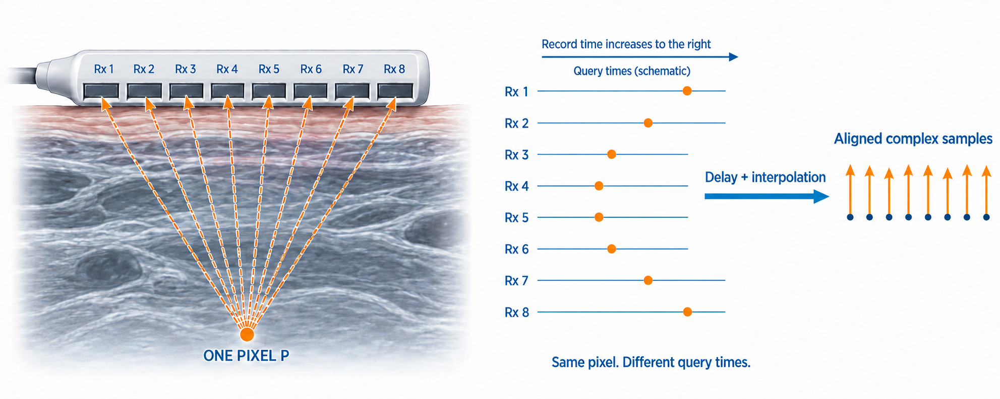

**图 1｜固定同一像素，各通道在不同记录时刻取样。** 中间的线表示时间轴，橙点表示查询位置；右侧箭头表示取出的复数观测。图示采用理想相干情形，真实对齐后的箭头未必同向。AI 概念图不按比例，组织背景也是插画，不是本章数据。

用复数箭头理解最直观：箭头长度代表幅值，方向代表相位。方向接近时，相加容易变大；方向相反时，相加会相消。Conventional DAS 已经做了：

$$ S(P)=\sum_{m=1}^{M}s_m(P). $$

于是新的问题是：**最终的和很大，是多数通道共同支持它，还是少数很强的通道主导它？和很小，又是因为本来就弱，还是有能量但在相消？**

CF 与 GCF 都从这组 $\mathbf{s}$ 出发，为当前像素计算一个实数权重。权重需要求和前的通道数据；只拿一张 DAS B-mode 图，无法还原这些信息。

### 2. CF：把相干和与通道能量放在一起看

**Coherence Factor（CF，相干因子）** 的本章定义是：

$$ \mathrm{CF}(P)=\frac{|S(P)|^2}{M\sum_{m=1}^{M}|s_m(P)|^2}. $$

先把式子拆成三个量：

| 量 | 怎样得到 | 在问什么 |
|---|---|---|
| $S=\sum_m s_m$ | 保留相位，相干相加 | 不同通道相加后留下多少响应？ |
| $E=\sum_m\lvert s_m\rvert^2$ | 各自取幅值平方，再相加 | 通道本来一共有多少样本能量？ |
| $ME$ | 用有效通道数作尺度归一化 | 在同样能量下，相干和功率最多能有多大？ |

分母里的 $M$ 不能漏。由 Cauchy–Schwarz 不等式，$|S|^2\le ME$，所以非零能量时 $0\le\mathrm{CF}\le1$。通道全部为零时，本章实现将权重置零，避免除以零。

#### 2.1 用四个数算一遍

下面都取 $M=4$。即使某个有效通道的样本值恰好为零，它仍是这四个通道之一。

| 对齐后的 $\mathbf{s}$ | $S$ | $E$ | CF | 解释 |
|---|---:|---:|---:|---|
| $[1,1,1,1]$ | 4 | 4 | 1 | 幅值、相位都相同 |
| $[1,1,-1,-1]$ | 0 | 4 | 0 | 每个通道都有能量，求和却完全相消 |
| $[1,1,1,4]$ | 7 | 19 | $49/76\approx0.645$ | 都同相，但幅值分布不均 |
| $[1,0,0,0]$ | 1 | 1 | $1/4$ | 一个通道主导，缺乏多通道共同支持 |

**CF 不只检查相位。** 在这个定义下，CF 等于 1 要求有效复数样本全部相等：幅值与相位都相同。“所有通道同相”本身不够。

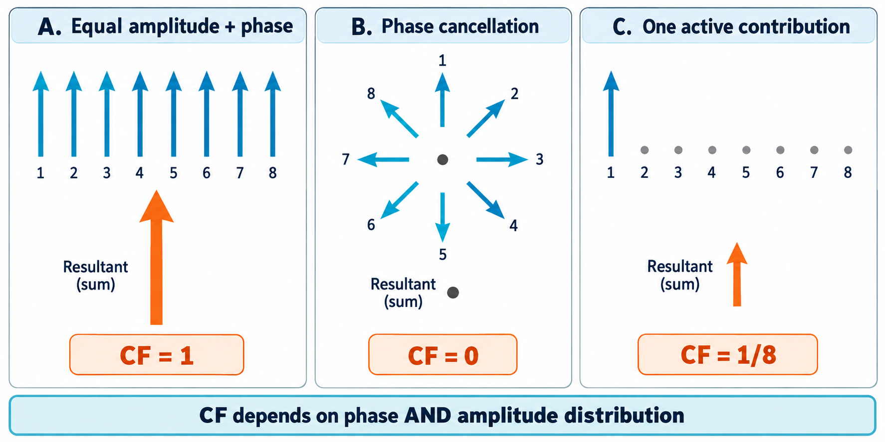

**图 2｜八通道的三个数学例子。** 左图样本完全一致；中图成对反向而相消；右图仍有八个有效通道，但只有一个非零贡献，所以 CF 为 $1/8$。箭头与合力长度仅示意。AI 图不代表真实组织的分类结果。

#### 2.2 CF 衡量的是一致性，不是“目标真假”

正确聚焦的点状回波往往能形成较一致的通道观测，因此可能获得较高权重；离轴贡献、像差、混响或噪声等可能降低一致性。但真实散射、通道幅值变化和孔径也会影响 CF。

因此不能直接把“高 CF”翻译为“真目标”，把“低 CF”翻译为“噪声”。CF 是一个数值判据，不是组织或杂波的标签。

### 3. 从一个 CF 数字到一整张加权图像

CF 的输出用来乘同一个像素的复数 DAS 值：

$$ Y_{\mathrm{CF}}(P)=\mathrm{CF}(P)\,S(P). $$

非负实数 CF 只改变该复数像素的幅值，不校正相位。它也不重新计算 Tx/Rx delay、重新选聚焦位置或恢复已相消的信号。

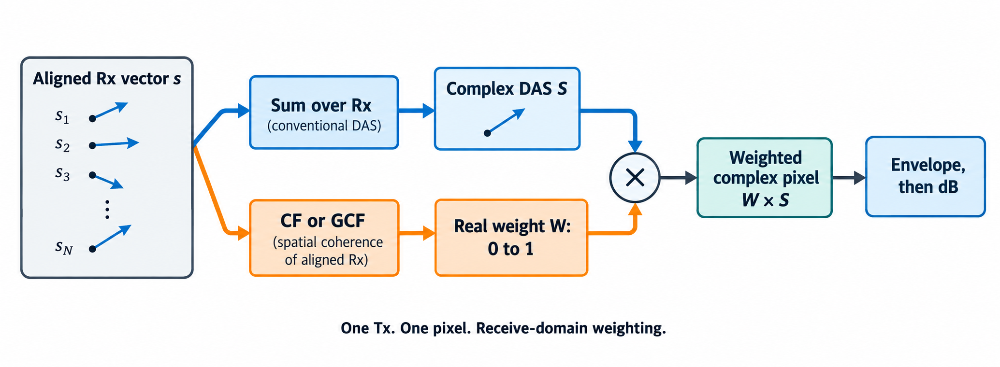

**图 3｜同一通道向量分成两路，再汇合。** 上路沿 Rx 求和得到复数 DAS；下路从求和前的向量计算实数权重；乘权后才取包络和 dB。AI 概念图中的 W 指 CF 或 GCF，不是第一章 RTB 的 Tx 权重和。

对整张图重复同一个操作：

1. 按 conventional FI 的方式选当前 Tx、扫描线与深度。
2. 保持第一章的几何与插值，取得有效接收向量 $\mathbf{s}(P)$。
3. 一路求 $S(P)$，另一路求 $\mathrm{CF}(P)$。
4. 保存 $Y_{\mathrm{CF}}=\mathrm{CF}\,S$。
5. 遍历所有像素，再取包络并转换为 dB。

一个像素的 CF 为 0.2 时，它的包络变成原来的 0.2；在共同幅值参考下，变化约为 $20\log_{10}(0.2)=-14.0$ dB。CF 为 1 时保留原 DAS 值。

这已经解释了为什么 CF 图可能更暗、亮结构边缘更窄：不同位置被乘上了不同权重。到底压低了旁瓣、正常组织纹理还是某种混合贡献，要在后面的实验中分开观察。

### 4. 换一个视角：接收通道向量也是一个“空间信号”

先区分两条轴。沿 RF 的**时间样本**做 FFT，可以看时间频率；沿 $\mathbf{s}$ 的**接收阵元序号**做 FFT，可以看通道观测沿孔径变化得快不快。

本章 GCF 用第二种：

- 各通道复数值相同：沿阵元方向不变化，频谱能量在 DC（零空间频率）。
- 相位随通道平滑旋转：存在有规律的空间变化，能量可移到邻近 DC 的 bin。
- 相位变化不规则：能量可能分散到更宽的空间频带。

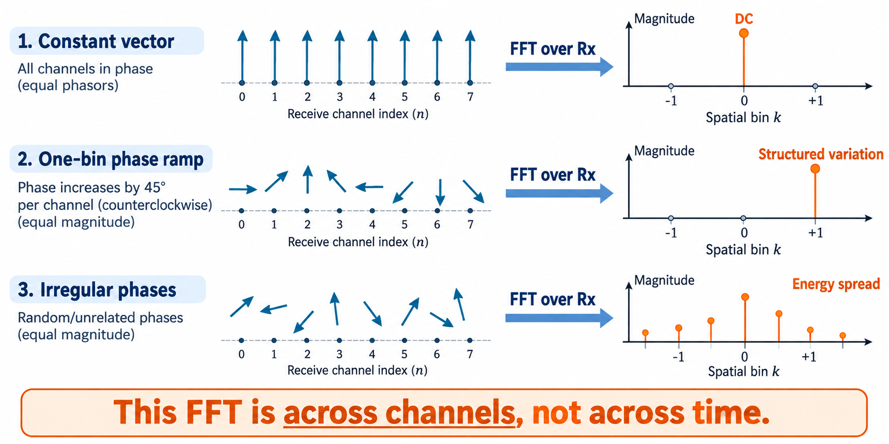

**图 4｜FFT 沿 Rx，而不是沿时间。** 中间一行用八通道、每通道旋转 45° 的数学向量，频谱移到 +1 bin。右侧是频谱幅值示意；真正计算能量时要用幅值平方。第三行仅示意频谱分散，不是某个随机向量的精确计算。AI 图中的频率不以 Hz 表示。

这里的 bin 是离散频谱格点。对通道向量作未归一化 DFT：

$$ X[k]=\sum_{m=1}^{M}s_m\,e^{-j2\pi k(m-1)/M},\qquad k=0,\ldots,M-1. $$

先只看最容易理解的 $k=0$。指数项全为 1，因此：

$$ X[0]=\sum_m s_m=S,\qquad \sum_k|X[k]|^2=M\sum_m|s_m|^2. $$

第二个等式是 Parseval 关系。把两式放进 CF，得到：

$$ \mathrm{CF}=\frac{|X[0]|^2}{\sum_k|X[k]|^2}. $$

**普通 CF 恰好等于孔径频谱的 DC 能量占比。** 这不是另一个算法，而是同一公式换一种看法。它自然引出下一步：如果有用的通道结构没有严格停在 DC，是否应该容许邻近的低空间频率？

### 5. GCF：把 DC 扩展成一个低空间频率带

**Generalized Coherence Factor（GCF，广义相干因子）** 保留 CF 的“能量占比”思想，把分子从 DC 一个 bin 扩展为一段低空间频率带。[Li 与 Li，2003](https://pubmed.ncbi.nlm.nih.gov/12625586/)给出了这一思路，以及只保留 DC 时退化为 CF 的关系。

本项目用 $M_0$ 表示以 DC 为中心的**低频半宽，单位为 FFT bin**：

| 本项目参数 | 纳入分子的 signed bins | 理解 |
|---|---|---|
| $M_0=0$ | $\{0\}$ | DC only，正好是 CF |
| $M_0=1$ | $\{-1,0,+1\}$ | 最小的相邻低频扩展 |
| $M_0=2$ | $\{-2,-1,0,+1,+2\}$ | 再放宽一层 |
| $M_0=4$ | $\{-4,\ldots,0,\ldots,+4\}$ | 接受更多孔径变化 |

表格假设当前孔径有足够的独立 bins；小孔径的截断在第 12 节说明。记实际选中的独立 bins 为 $\mathcal K(M_0)$：

$$ \mathrm{GCF}(P;M_0)=\frac{\sum_{k\in\mathcal K(M_0)}|X[k]|^2}{\sum_k|X[k]|^2},\qquad Y_{\mathrm{GCF}}(P)=\mathrm{GCF}(P;M_0)\,S(P). $$

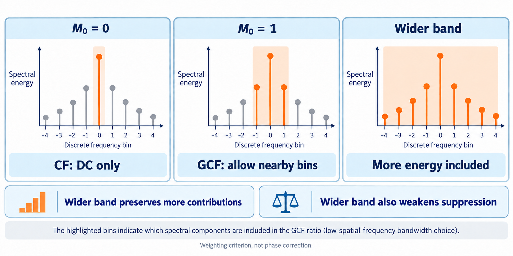

**图 5｜频谱相同，改变的只是纳入分子的范围。** 橙色 bins 计入分子，全部 bins 始终计入分母。该图解释比值的计算，没有把频谱裁掉再逆变换。AI 示意图不提供数值性能结论。

#### 5.1 M0 越大，意味着什么？

对同一个非零通道向量，扩大频带只会向分子加入非负能量，所以：

$$ \mathrm{CF}=\mathrm{GCF}(0)\le\mathrm{GCF}(1)\le\mathrm{GCF}(2)\le\cdots\le1. $$

在同一 DAS 和共同幅值参考下，权重更大表示抑制更弱。这样可能保留更多平滑空间结构，也可能保留更多本来希望压低的贡献。**M0 控制取舍，不代表算法等级，也不存在由这个公式保证的通用最优值。**

如果选到全部频谱，GCF 为 1，输出回到原 DAS。

#### 5.2 一个关键例子：较高 GCF 不等于信号被修复

取等幅的一 bin 相位坡：

$$ s_m=e^{j2\pi(m-1)/M}. $$

这些箭头绕复平面完整一圈，$S\approx0$；频谱却集中在 +1 bin。因此 CF 约为 0，GCF$(M_0=1)$ 约为 1。

但最终仍是 $\mathrm{GCF}\times S\approx0$。**GCF 认可了这个向量的低频结构，却没有把它重新调成同相。** 这个例子用于解释权重判据，不证明相位坡对应真实目标，更不意味着 GCF 修正了延时误差。

### 6. 把 CF 与 GCF 放回同一条成像主线

| 环节 | 第一章 DAS | 本章 CF | 本章 GCF |
|---|---|---|---|
| 传播时间与通道取样 | 按 Tx/Rx 几何与插值 | 保持相同 | 保持相同 |
| 单像素输入 | 有效复数 Rx 向量 $\mathbf{s}$ | 同一向量 | 同一向量 |
| 接收相干和 | $S=\sum_m s_m$ | 同一 $S$ | 同一 $S$ |
| 新增判据 | 无 | DC 能量比例 | 低频带能量比例 |
| 复数输出 | $S$ | $\mathrm{CF}\,S$ | $\mathrm{GCF}\,S$ |
| 最后显示 | 包络 → dB | 包络 → dB | 包络 → dB |

~~~mermaid
flowchart LR
    A[一次 Tx 的复数解析 RF] --> B[按像素计算 Tx 和 Rx 时间]
    B --> C[插值并选择有效 Rx]
    C --> D[通道向量 s]
    D --> E[沿 Rx 求和 S]
    D --> F[CF 或 aperture FFT 后的 GCF]
    E --> G[权重乘复数 DAS]
    F --> G
    G --> H[遍历像素后取包络与 dB]
~~~

读到这里，应能连贯讲出：**CF/GCF 用第一章已经对齐的数据，计算逐像素的一致性权重，再对同一个 DAS 结果乘权。GCF 将 CF 的 DC 判据放宽到低空间频率带。**

然后再打开 MATLAB，从可控的人工向量走向真实图像。

## 第二部分：从 MATLAB 向量走到真实图像

### 7. 先用人工向量验证“公式到底在看什么”

在仓库根目录打开 MATLAB：

~~~matlab
cd matlab/02_CF_GCF
demo_cf_aperture_vectors
demo_cf_failure_and_gcf_motivation
~~~

两个演示不需要 USTB 或 UFF。它们先控制输入，再观察权重，因此比一开始看整张复杂组织图更容易理解因果关系。

#### 7.1 CF：相位、幅值与相干和一起看

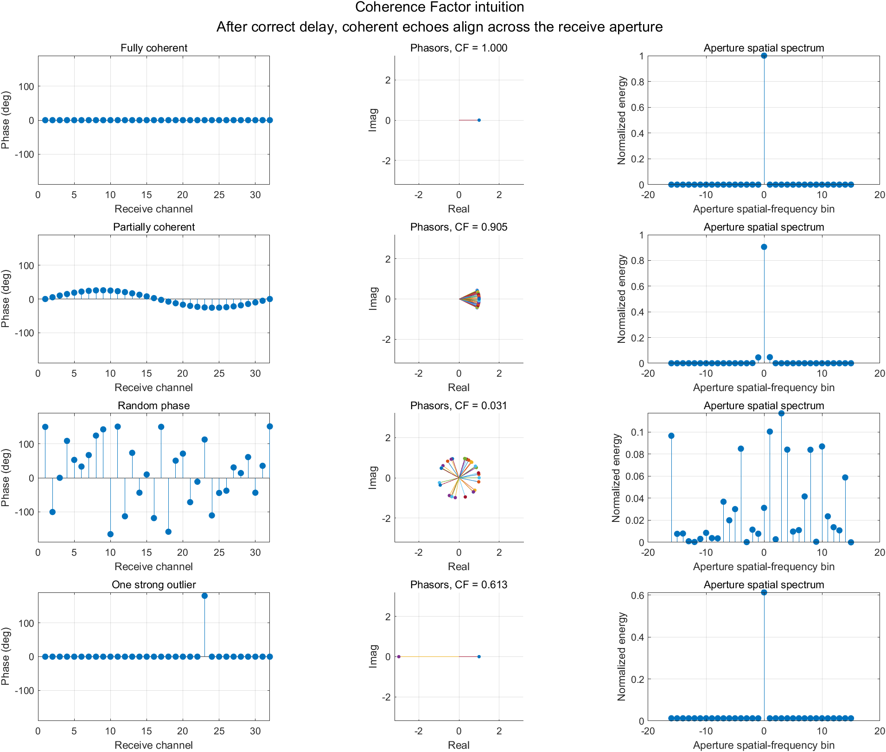

**图 6｜四行是四种人工输入。** 每行依次看 phase、phasors 和孔径频谱，再核对 CF 数字。这里的通道向量已经视为对齐后的输入，不包含传播模拟。

本次运行的 32 通道结果：

| 人工输入 | CF | 读图重点 |
|---|---:|---|
| 幅值与相位相同 | 1.000000 | 所有样本相等的上界 |
| 平滑的正弦相位变化 | 0.905494 | 小幅相位变化仍保留较强相干和 |
| 随机相位，`rng(1)` | 0.031249 | 一次随机实现，不是所有噪声的固定权重 |
| 一个 3 倍幅值、反相的异常通道 | 0.612500 | 强通道的幅值与相位共同影响结果 |

先预测“分子、分母谁会变”，再运行脚本。不要只看某张箭头图的方向是否大致相同。

#### 7.2 GCF：用一 bin 相位坡解释低频扩展

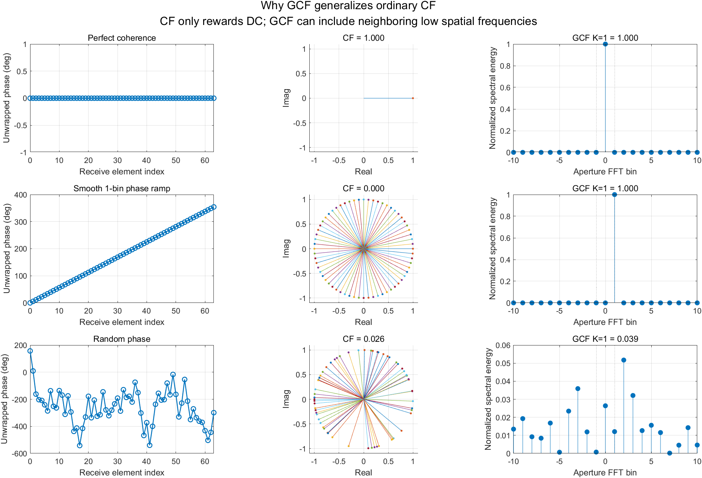

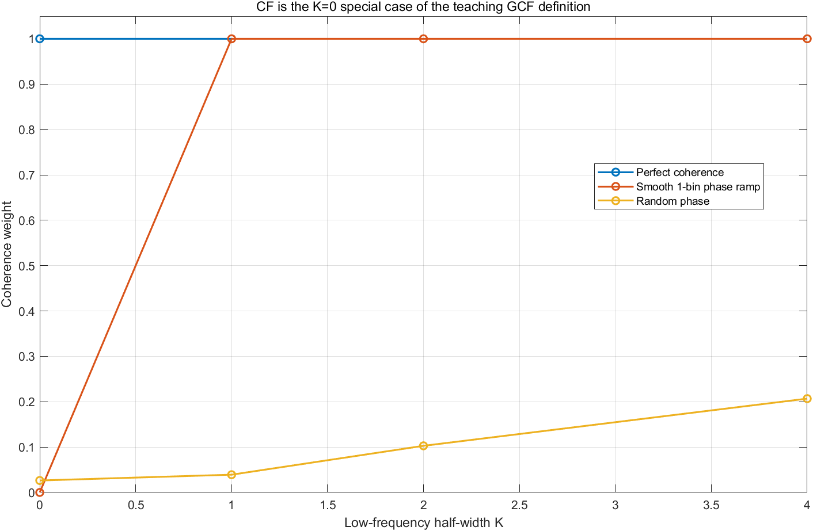

**图 7｜先看频谱的位置，再看带宽对应的权重。** 第一张中间行的谱峰在邻近 DC 的 bin，所以纳入该 bin 后 GCF 接近 1；它的 DAS 和仍接近零。第二张显示随机相位也会随带宽扩大而获得更高权重。

该演示使用 64 通道、`rng(2)`。随机相位的 CF 约 0.026378；GCF 半宽 1、2、4 时约为 0.039178、0.102806、0.206858。

演示中的 `K` 与正式核心的 `M0` 都表示低频半宽。此处为了看清频谱结构画了 `fftshift`；正式核心可以不移动 FFT 顺序而直接选首尾 bins，数值含义相同。

### 8. 回到真实数据：在 DAS 求和前停下来

接下来需要 USTB 读取器。在当前 `matlab/02_CF_GCF` 目录设置：

~~~matlab
addpath(genpath('D:/USTB'));  % 换成自己的 USTB 路径
addpath('../01_DAS_Real_UFF');
filename = '../../data/L7_FI_TheGB.uff';

n_z = 512;
selected_pixels_mm = [-0.75 20.05; 8 22; 10 10];
inspect_real_cf_aperture_vectors
~~~

如果不提供 `selected_pixels_mm`，脚本保留交互选点。提供坐标后，每个点会吸附到实际 scanline 与深度网格；记录吸附后的坐标，才知道公式对应哪个像素。

默认 TheGB 数据的 `[sample,Rx,Tx,frame]` 为 `[1920,128,128,1]`，输入是实数 RF。它先沿时间维转为复数解析 RF，再查询当前像素的通道观测：

~~~text
rf_wave         [sample,Rx]
    ↓ 沿 sample 构造解析 RF
analytic_wave   [sample,Rx] complex
    ↓ 每个 Rx 自己的 Tx+Rx 查询时间与插值
focused_samples [1,N_Rx] complex
    ↓ 有效接收孔径与记录范围
s               [1,M_active] complex
    ├─ sum(s) → 复数 DAS
    └─ coherence(s) → 实数权重
~~~

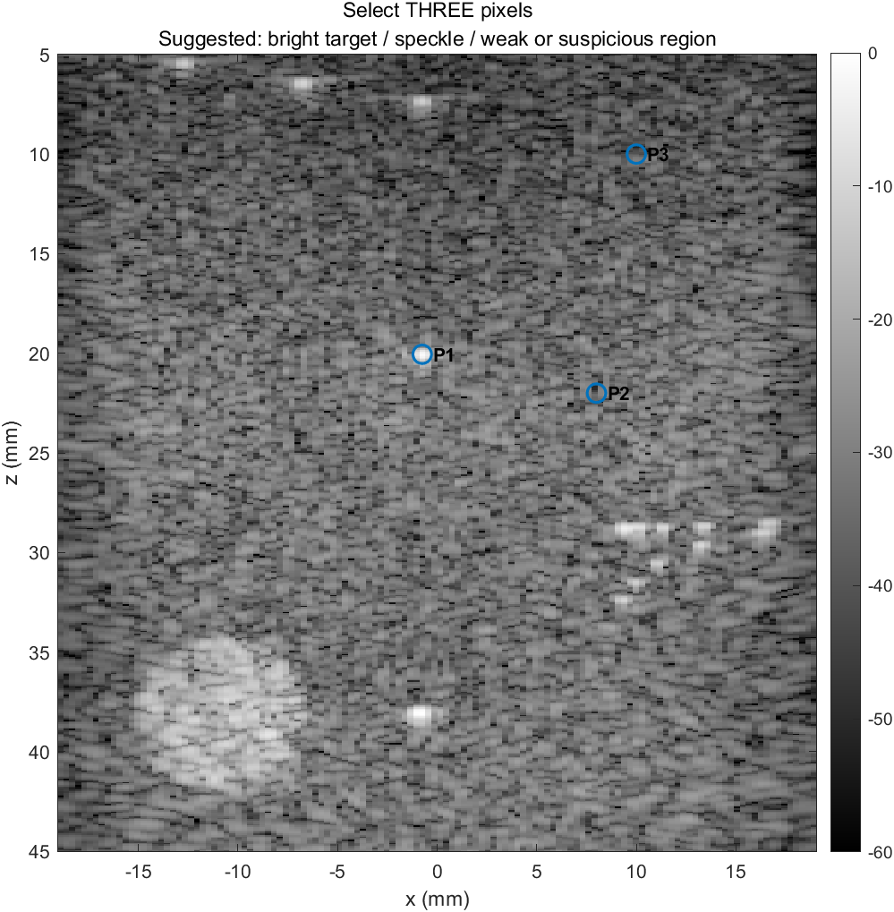

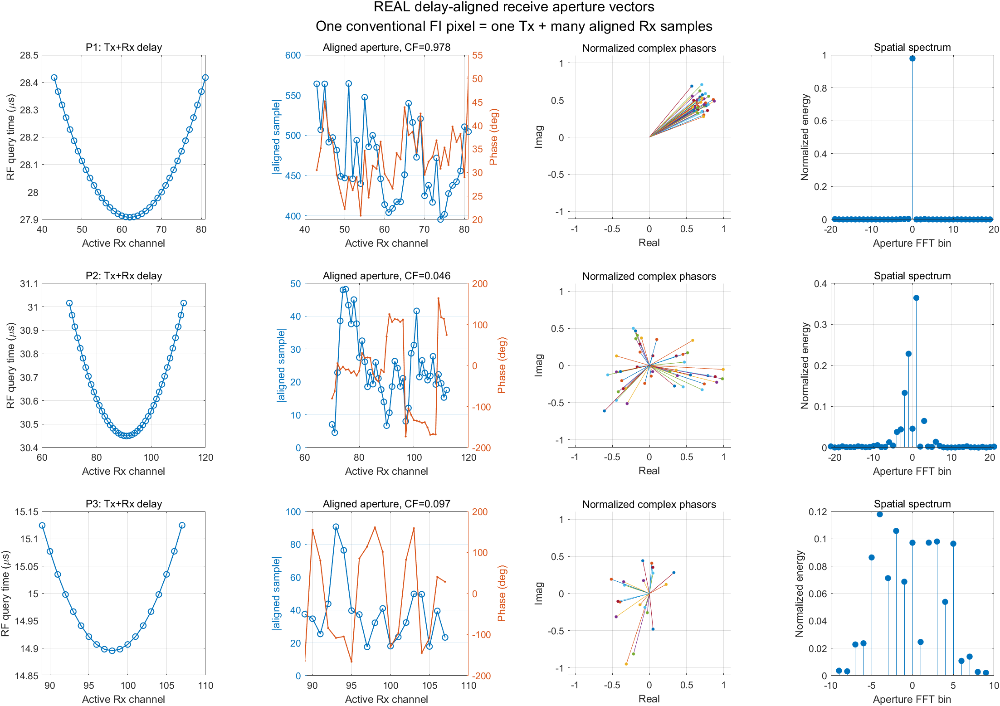

**图 8｜每一行对应一个候选像素。** 从左到右，把第一章的查询时间重新接到本章的幅值、相位、phasor 和 aperture spectrum。不同通道使用不同查询时间；不能在原始 RF 上截一条等时间横线替代它。

本次 512 深度点、Rx F# 1.7 的实际结果为：

| 点 | 吸附后的 $(x,z)$，mm | Tx | 有效 Rx 数 M | CF |
|---|---|---:|---:|---:|
| P1 | 约 (−0.745,20.029) | 62 | 39 | 0.978040 |
| P2 | 约 (7.896,21.986) | 91 | 43 | 0.046026 |
| P3 | 约 (9.982,10.010) | 98 | 19 | 0.097147 |

P1 接近所选亮点，通道响应较一致。P2 的 CF 虽低，频谱却在 DC 附近有明显结构，可以用来思考 GCF 会接受哪些贡献。仅凭这三个权重，不能给 P2、P3 判定组织或杂波类型。

脚本还把 `sum(s)` 与第一章同一像素的复数 DAS 比较。本次三个查询点的绝对复数差均为 0，说明拿出的向量确实接回同一条计算链。

### 9. 把单像素操作重复成整张图

#### 9.1 先看 DAS、CF map 和加权结果

~~~matlab
n_z = 512;
compare_manual_das_vs_cf
~~~

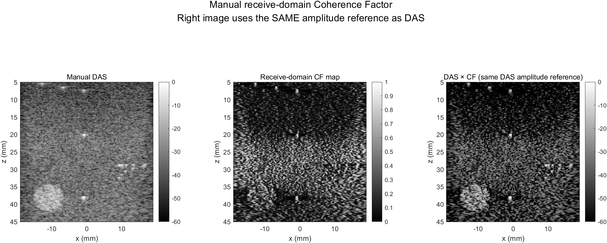

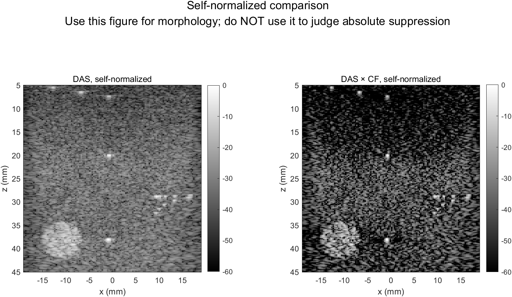

**图 9｜先看共同参考，再看各自归一化。** 第一张的 CF map 色条为 0–1，表示权重；两侧 B-mode 色条为幅值 dB。第二张更适合比较形态，但隐藏了整体幅值变化。不要把两种色条或两种参考混为一谈。

本次 CF map 的 min / median / mean / max 约为 **0.000006 / 0.178151 / 0.237657 / 0.979233**。权重 0.178 对应约 −15 dB 的逐像素幅值变化；这不是整张图平均回波能量降低 15 dB 的结论。

该入口独立调用第一章基线。第二章内部 DAS 与第一章 DAS 的最大绝对复数误差约 `1.14e-13`，相对全图峰值约 `5.33e-18`。数值结果支持当前条件下保留了原有 DAS 路径。

#### 9.2 再看 GCF：同一 DAS，换一个权重判据

~~~matlab
n_z = 512;
M0 = 1;
compare_manual_das_cf_gcf
~~~

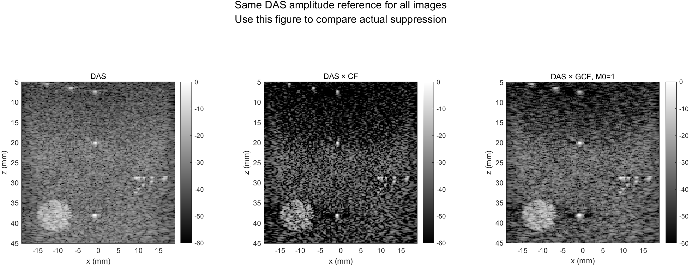

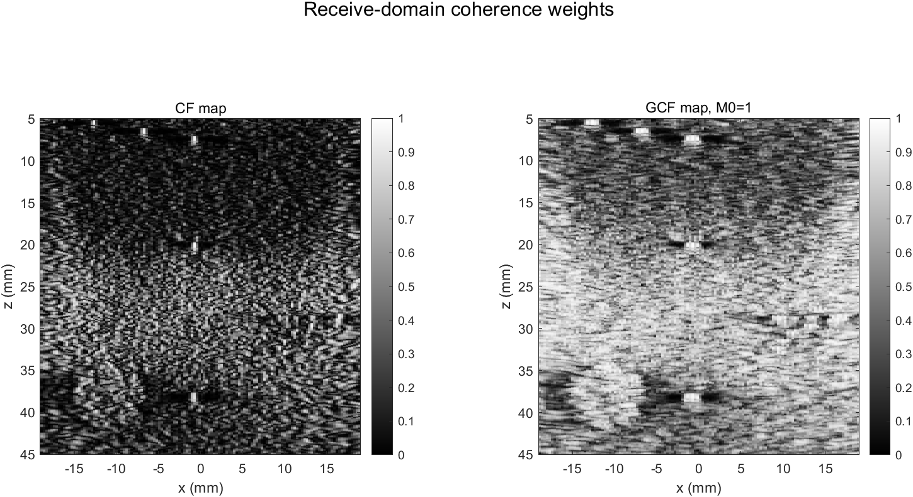

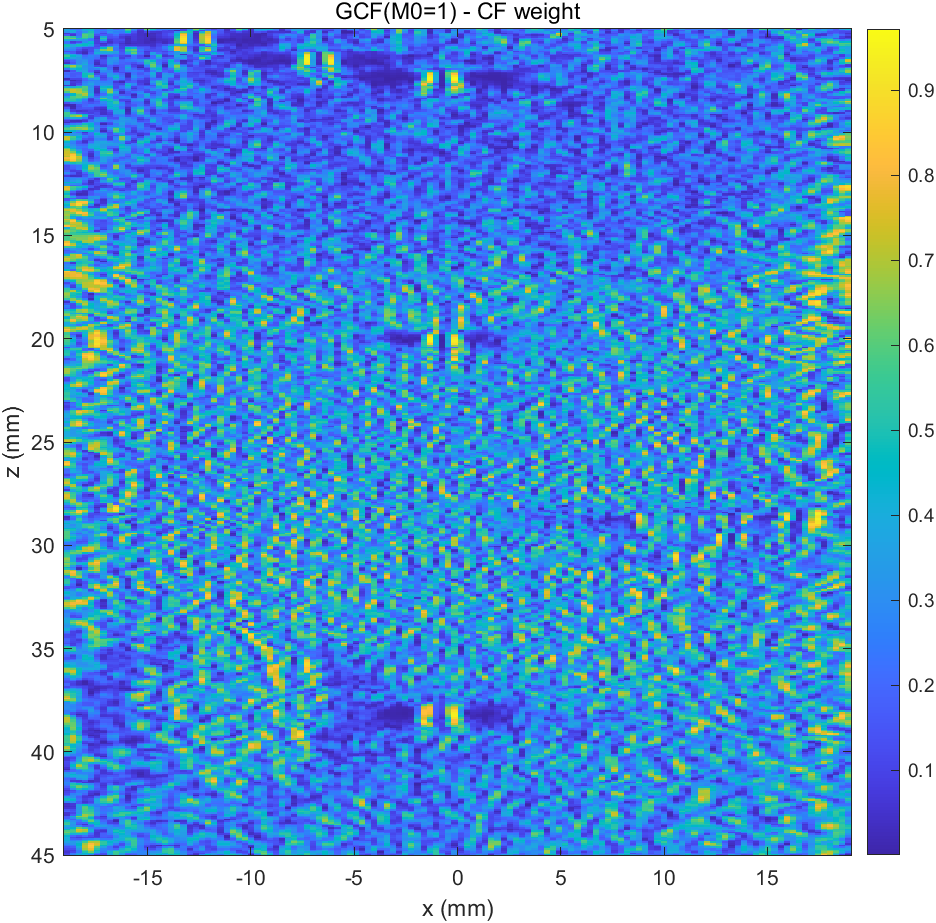

**图 10｜把图像变化追溯到权重变化。** 第一张都用同一 DAS peak 作 0 dB；第二张看权重；第三张的差是 GCF−CF，不是相对真值的成像误差。纳入邻近低频 bins 后，更多像素的权重升高。

本次 `M0=1` 的 GCF median / mean / max 约为 **0.564431 / 0.547076 / 0.987204**。CF 与 GCF 核心的 DAS 完全一致；`GCF(M0=0)` 与 CF 的最大差约 `9.99e-16`。

这两个检查分别回答：**DAS 有没有被意外改动？DC-only 是否真的退化为 CF？** 它们是内部一致性验证，不能替代独立的物理模型或图像质量验证。

核心输出可以直接对应理论中的对象：

手写核心分别是 [reconstruct_fi_cf_manual.m](../../matlab/02_CF_GCF/reconstruct_fi_cf_manual.m) 与 [reconstruct_fi_gcf_manual.m](../../matlab/02_CF_GCF/reconstruct_fi_gcf_manual.m)。先在逐像素循环里找到 `s = focused_samples(active)`，再沿着求和、权重和复数乘权向下读。

| 字段 | shape | 数据意义 |
|---|---|---|
| `das_analytic` | `[N_z,N_scanline]` complex | 原始接收相干和 $S$ |
| `cf_map` / `gcf_map` | 同上，real | 0–1 的逐像素权重 |
| `cf_analytic` / `gcf_analytic` | 同上，complex | 权重乘同一个 $S$ |
| `*_envelope` | 同上，real | 复数结果的幅值 |
| `*_db_common` / `*_db_self` | 同上，real | 不同幅值参考下的显示 |
| `active_channel_count` | 同上 | 每个像素参与计算的有效 Rx 数 |

### 10. 修改 M0，再用目标剖面观察取舍

#### 10.1 先预测带宽变宽会怎样

~~~matlab
n_z = 256;
M0_values = [0 1 2 4];
experiment_gcf_m0_sweep
~~~

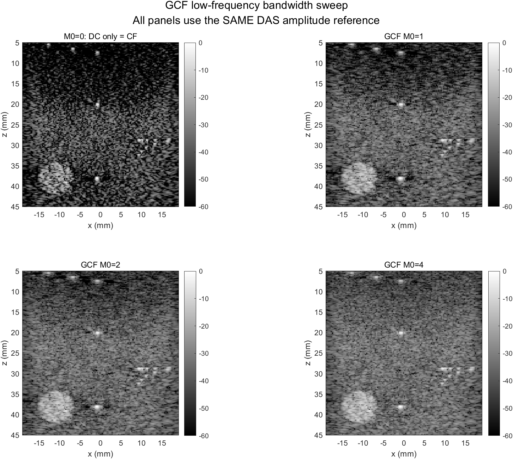

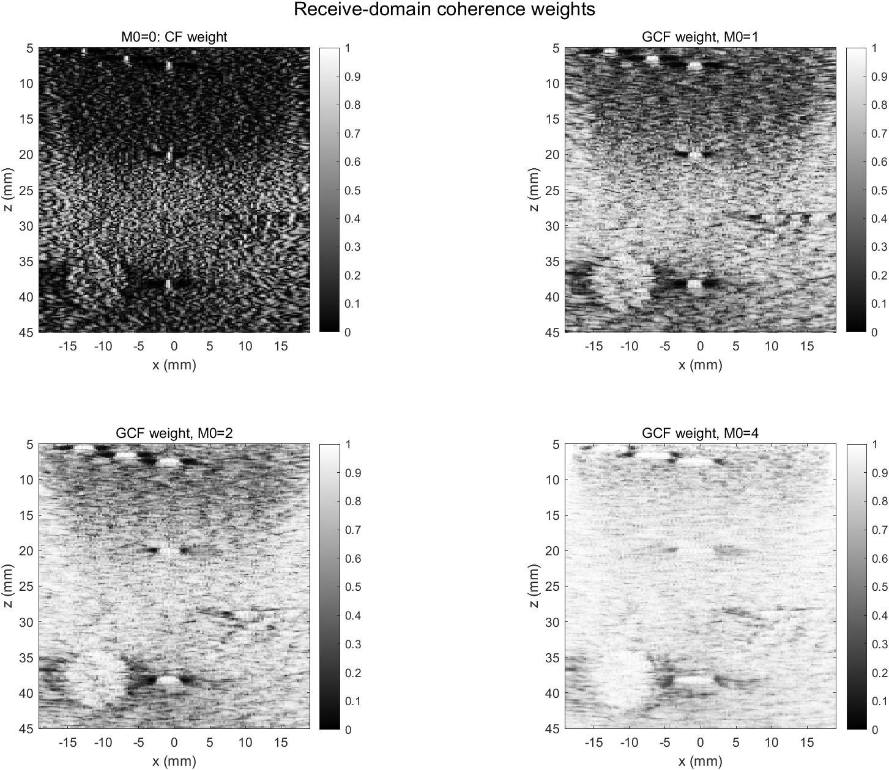

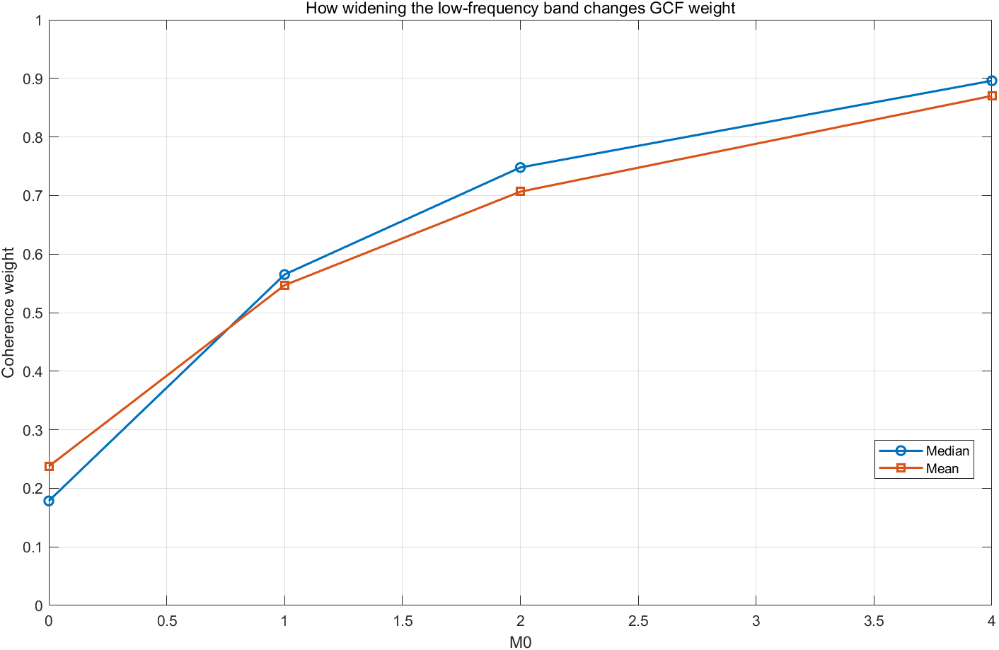

**图 11｜频带更宽，接受更多孔径能量。** 保持数据、DAS、网格和 Rx aperture 相同，只改变 M0。本次导出还逐像素验证权重随 M0 不下降、DAS 不变。

| M0 | median weight | mean weight |
|---:|---:|---:|
| 0（CF） | 0.17847 | 0.23755 |
| 1 | 0.56509 | 0.54686 |
| 2 | 0.74785 | 0.70652 |
| 4 | 0.89595 | 0.87012 |

均值的增加表示每个像素的低频能量占比平均增加；不是把所有像素的原始能量加在一起求比例。某些权重达到 1，也可能因为小孔径已被这个频带全部覆盖，不能都叫“完美聚焦”。

观察完以后应能回答：图像更接近 DAS，来自更准确的传播时间，还是更宽松的权重？本实验只改变后者。

#### 10.2 DAS 与 CF：先定位目标，再看两个方向

~~~matlab
n_z = 1024;
target_x_mm = -0.75;
target_z_mm = 20.05;
analyze_das_vs_cf_point_target
~~~

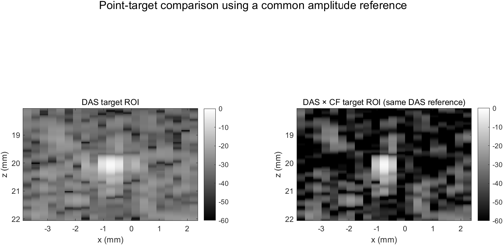

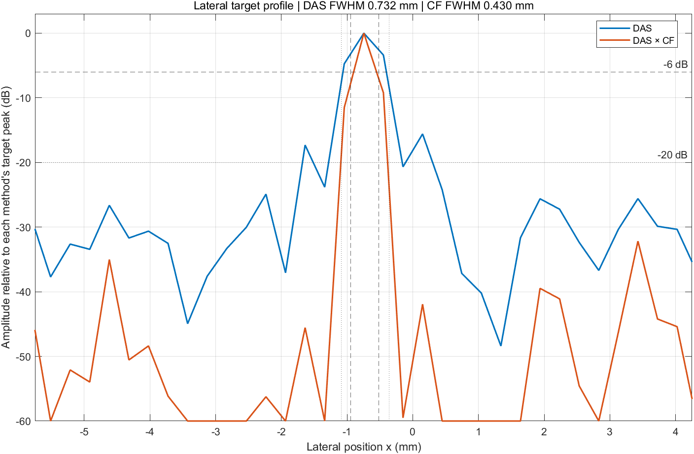

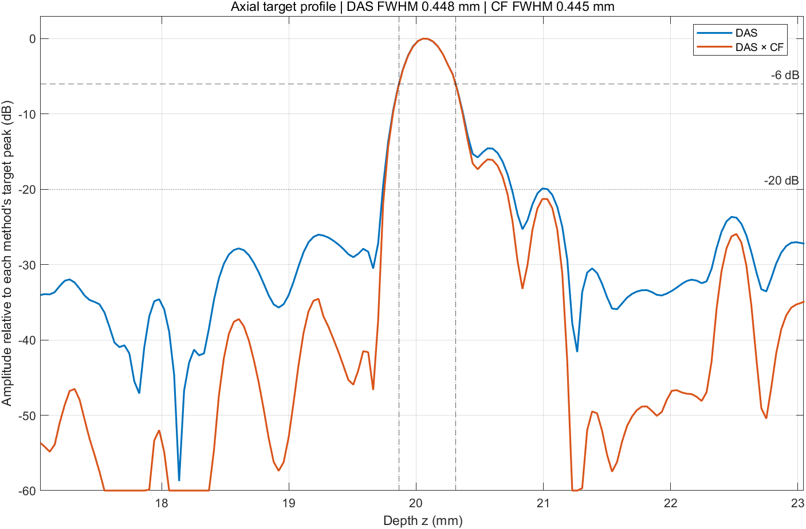

**图 12｜先确定比较的是同一个目标。** 各方法在同一局部范围寻找峰，再画横向与轴向剖面；脚本分别提供共同参考和局部峰归一化。轴向剖面的横轴为深度。

本次 1024 深度点结果：

| 量 | DAS | CF 加权 |
|---|---:|---:|
| 局部峰位置，mm | 约 (−0.745,20.054) | 相同 |
| 相对 DAS 的局部峰变化 | 0 dB | −0.221 dB |
| 横向包络半幅宽度 | 0.7322 mm | 0.4304 mm |
| 横向宽度跨 scanline 间隔 | 2.457 | 1.445 |
| 轴向包络半幅宽度 | 0.4479 mm | 0.4452 mm |
| 横向 −20 dB 连续宽度 | 1.1676 mm | 0.9944 mm |

当前目标峰基本保留，横向加权后的响应明显变窄，轴向变化较小。横向只跨少量扫描线，宽度是粗采样估计，不能据此给出高精度“物理分辨率提升百分比”。

这里的目标是从真实数据选出的 point-like 回波，没有独立理想点真值。−20 dB 连续宽度描述剖面外围，不等于严格的峰旁瓣电平。

#### 10.3 同一网格内比较不同 M0

~~~matlab
n_z = 512;
M0_values = [0 1 2];
target_x_mm = -0.75;
target_z_mm = 20.05;
analyze_gcf_m0_point_target
~~~

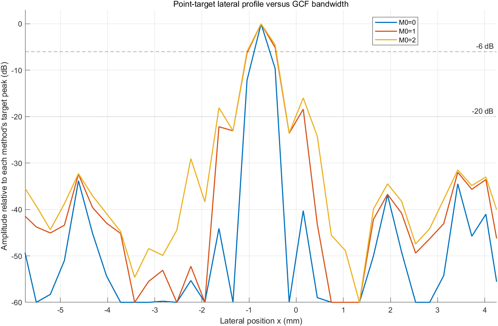

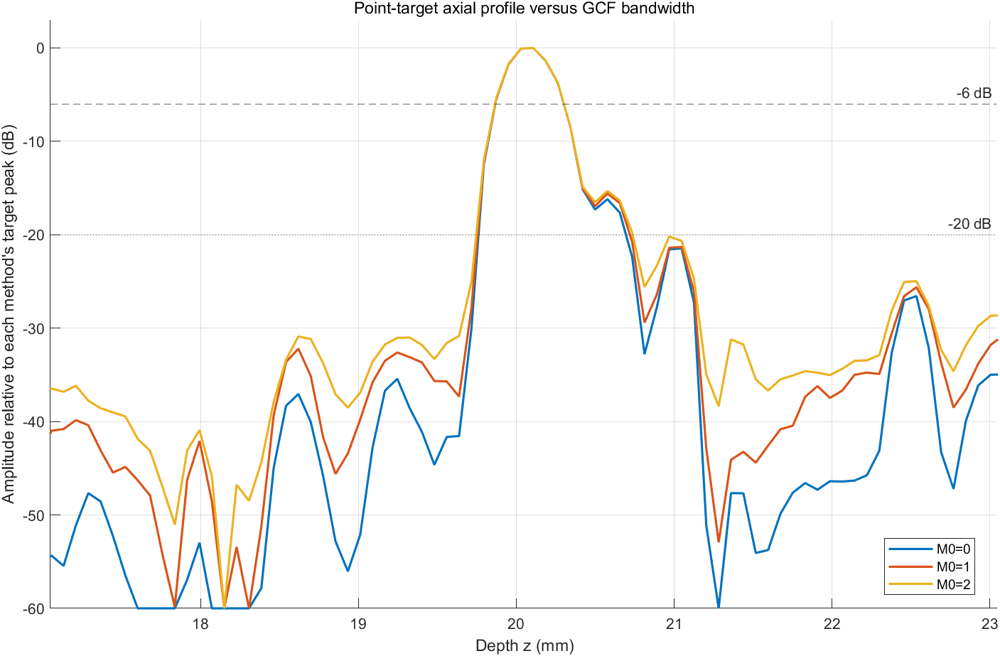

**图 13｜带宽变化主要在何处体现？** 比较本组曲线内部的峰值与外围变化。它使用 512 深度点，不能与图 12 的 1024 点结果混成一次只改算法的实验。

| M0 | DAS 峰位置处的权重 | 局部峰相对 DAS | 横向半幅宽 | 轴向半幅宽 |
|---:|---:|---:|---:|---:|
| 0 | 0.97873 | −0.187 dB | 0.4203 mm | 0.4421 mm |
| 1 | 0.98222 | −0.156 dB | 0.6205 mm | 0.4436 mm |
| 2 | 0.98362 | −0.143 dB | 0.6518 mm | 0.4449 mm |

在这个目标上，M0 增大只轻微改变峰值，却明显恢复了 CF 压低的横向外围响应。这个现象说明当前目标的取舍；不能推广成所有目标、组织或参数的固定行为。

### 11. 从点状回波走向组织纹理：扩展实验

理解前面的主线后，再选读本节。点目标看主峰，组织图还要看背景与结构连续性。

#### 11.1 选一个固定 ROI，看亮度与纹理如何变化

~~~matlab
n_z = 512;
M0_values = [0 1 2 4];
roi_corners_mm = [5 18; 11 24];
analyze_gcf_speckle_roi
~~~

也可不提供坐标，用两次点击选矩形。这里给定的 ROI 只是可复现的演示区域，没有被独立验证为理想均匀 speckle。

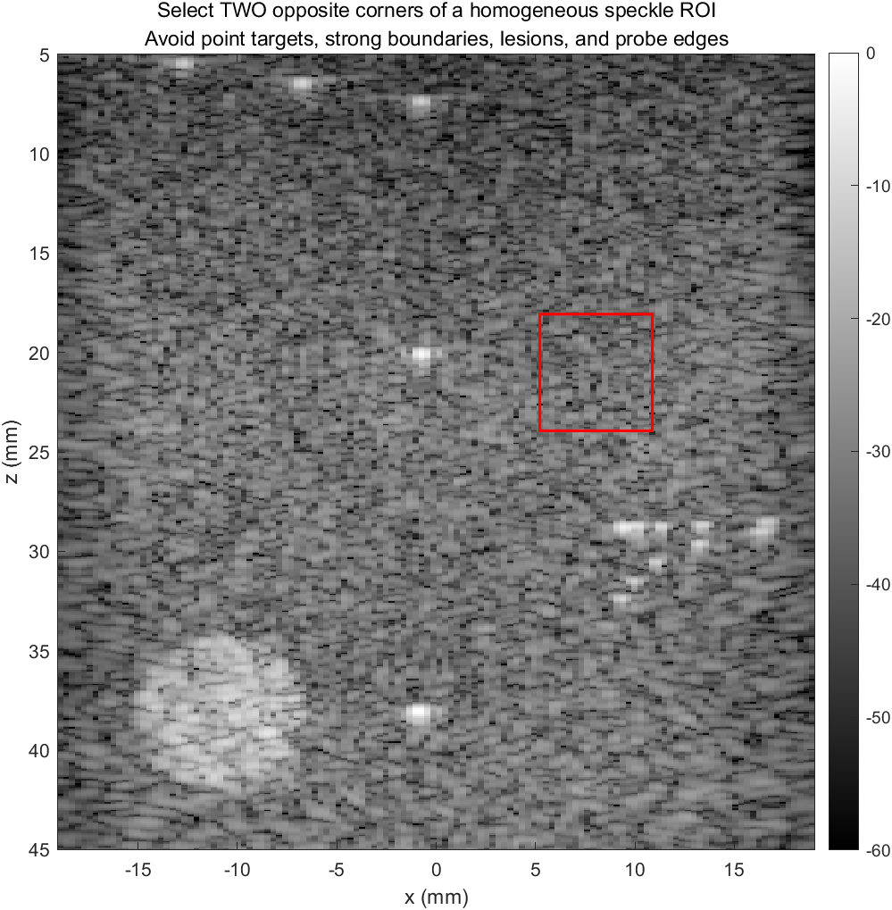

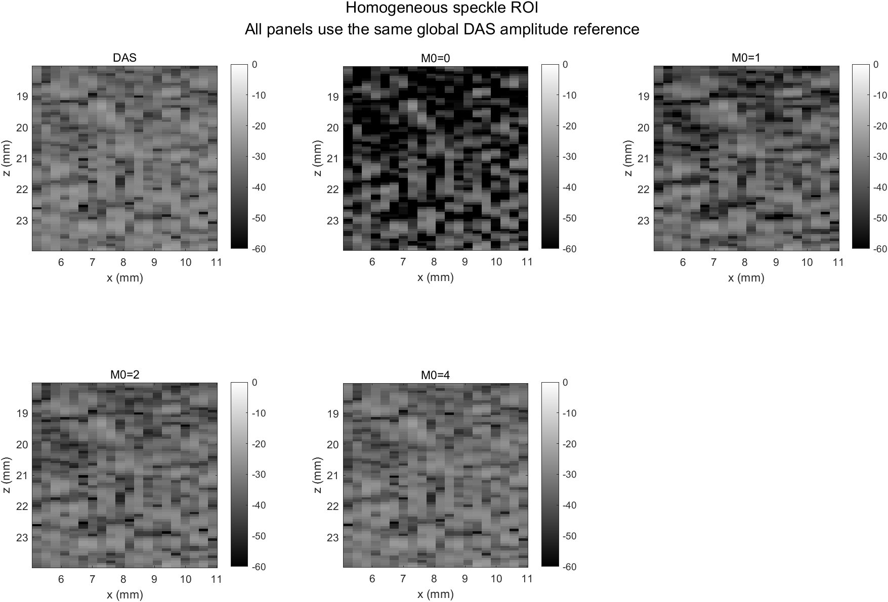

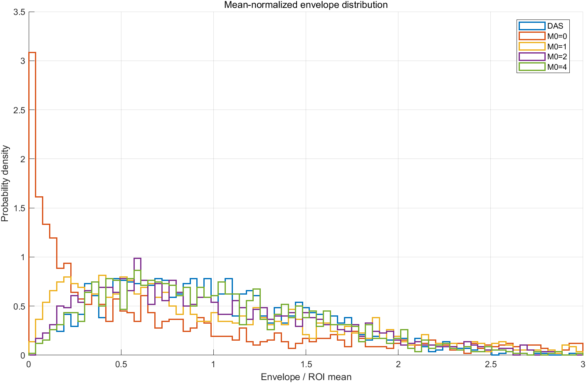

**图 14｜看平均亮度，也看纹理是否被重塑。** 第三张为各方法按 ROI 均值归一化的直方图，用于观察分布形状；它不能恢复被隐藏的幅值变化。

实际落到网格的 ROI 为 $x\approx5.215$–10.876 mm、$z\approx18.072$–23.943 mm，共 1520 个像素：

| M0 | ROI 平均包络相对 DAS | 与 DAS 包络的相关系数 |
|---:|---:|---:|
| 0（CF） | −10.79 dB | 0.9148 |
| 1 | −4.40 dB | 0.9464 |
| 2 | −2.02 dB | 0.9810 |
| 4 | −0.81 dB | 0.9964 |

本例中，带宽越宽，亮度与纹理越接近 DAS。这不证明 DAS 是理想真值，也不能仅凭 ROI 更暗判断杂波去除得更好。

#### 11.2 看两个真实颈动脉 acquisition

~~~matlab
n_z = 512;
M0 = 1;
compare_carotid_fi_cf_gcf_oneclick
~~~

入口读取 `L7_FI_carotid_cross_1.uff` 和 `L7_FI_carotid_cross_2.uff`；数据来源与下载方式见 [数据说明](../../data/README.md)。

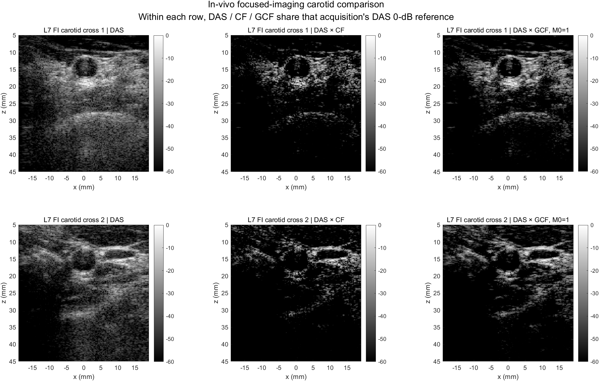

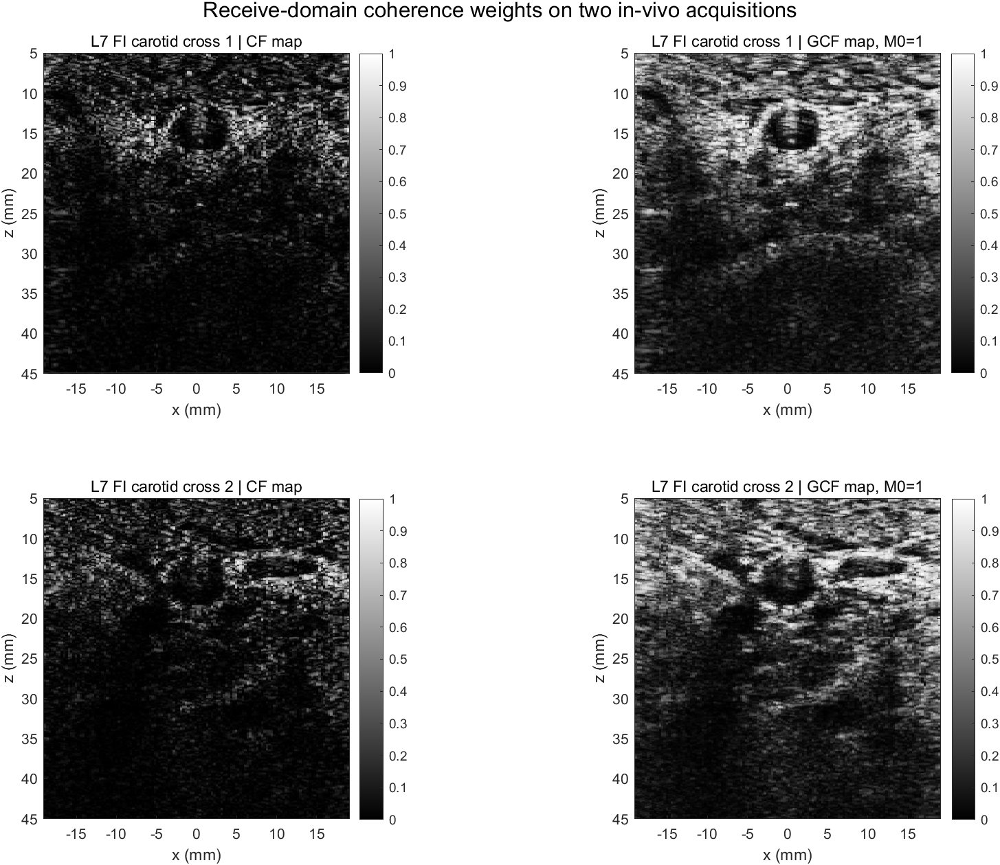

**图 15｜同一套算法，组织数据得到不同的权重分布。** 每一行用该 acquisition 自己的 DAS peak 作参考；同一行可比较抑制，不能跨行用绝对亮度作定量比较。两行都仍受各自采集条件影响。

| 本次数据，512 深度点 | CF median | GCF(M0=1) median |
|---|---:|---:|
| TheGB | 0.178151 | 0.564431 |
| carotid cross 1 | 0.037359 | 0.13767 |
| carotid cross 2 | 0.034161 | 0.13150 |

在这两个 acquisition 中，CF/GCF 对大量组织回波的抑制比 TheGB 更强。它们不是同一个目标、同一声场或受控的临床对照；散射、像差、孔径、噪声和采集设置等都可能参与差异。

下一步可以问：这种权重变化随深度怎样分布？第 14 节会同时看权重、DAS 幅值和有效通道数。

## 第三部分：主线掌握后，再逐项检查细节

下面按计算链回查：**输入向量 → 权重计算 → 显示与测量 → 解释与验证**。这些内容用于避免错误比较，不需要在第一轮讲理论时一起背下来。

### 12. 输入和频谱：保持孔径、维度与索引一致

#### 12.1 M 是当前像素的有效通道数

本章使用 full 或二值 boxcar 接收孔径。动态 F-number 时，浅层通常选较少通道，深层更多，边缘还受阵列边界限制。插值查询超出记录范围的通道也会被排除。

因此公式中的 $M$ 来自当前 active mask，不能把所有像素都写成硬件通道数 128。有效通道恰好取到零样本，与通道被排除是两回事。

本章接收 DAS 不除以有效通道数；CF 中的 $M$ 是权重公式的归一化。如果以后加入 Hann 等非二值 apodization，要先明确 CF 衡量加权前还是加权后的向量，以及相应定义，不能直接把有效数量公式照搬。

#### 12.2 两个 FFT 的轴不同

| 处理 | 输入 | FFT 轴 | 用途 |
|---|---|---|---|
| 从实数 RF 构造解析 RF | `[sample,Rx]` | sample，维 1 | 保留载频的复数时间信号 |
| GCF 的孔径频谱 | `[1,M_active]` | Rx，维 2 | 计算通道空间变化的能量占比 |

解析 RF 不是已经解调的基带 IQ。前面的 FFT 不会自动给出孔径频谱，后面的 FFT 也不描述发射脉冲的时间带宽。

CF 的和与总能量不依赖通道排列顺序；GCF 的空间频谱依赖排列。当前示例采用线性阵列的空间顺序；更换为非连续通道、稀疏阵列或不等间距阵元时，不能把压缩后的数组序号直接当等距空间轴。

对等间距、连续的 $M$ 通道、pitch 为 $d$ 的孔径，第 $k$ bin 对应空间频率 $k/(Md)$。所以相同 M0 在不同 M 下，对应的物理频带并不相同。

#### 12.3 signed bins 与 MATLAB 下标不能混用

`fftshift` 后的 signed bin 标签为：

$$ k=-\lfloor M/2\rfloor,\ldots,\lceil M/2\rceil-1. $$

DC 的 MATLAB 下标是 `floor(M/2)+1`。未移动的 `fft(s)` 中，下标 1 是 DC，正频率位于开头，负频率位于末尾。下标 1 不代表 signed bin +1。

核心使用未移动的 FFT 与首尾索引；下面用 shifted 版本解释同一数值操作：

~~~matlab
s = reshape(s,1,[]);            % 一个像素的有效 Rx 向量
M = numel(s);                   % 需先确认 M > 0
X = fftshift(fft(s,[],2),2);    % 沿 Rx
bins = -floor(M/2):ceil(M/2)-1;
M0_eff = min(M0,floor(M/2));
energy = abs(X).^2;
total_energy = sum(energy);

if total_energy > 0
    GCF = sum(energy(abs(bins)<=M0_eff)) / total_energy;
else
    GCF = 0;
end
~~~

小孔径没有无限多独立 bins。本章把半宽限制到 `floor(M/2)`；偶数长度的 ±Nyquist 对应同一个独立 bin，只计一次。全部 bins 被覆盖时，非零向量的 GCF 为 1。

`effective_M0_map`、`band_clipped_mask` 与 `band_clipped_fraction` 用于核对小孔径截断。若一片区域 GCF 为 1，先检查是否频带覆盖了全谱，再解释其相干性。

### 13. 显示与剖面：先统一参考，再讨论效果

#### 13.1 权重图不是 B-mode

CF/GCF map 没有回波幅值单位，色条为 0–1。加权复数结果的包络才用于 B-mode：

$$ A(P)=|Y(P)|,\qquad I_{\mathrm{dB}}(P)=20\log_{10}\frac{A(P)}{A_{\mathrm{ref}}}. $$

- **共同参考**：DAS、CF、GCF 都除以同一个 DAS peak，便于观察幅值抑制。
- **各自峰值参考**：各图除以自身 peak，便于看形态，但会隐藏整体衰减。
- **目标剖面参考**：各方法在同一目标 ROI 内找到自己的局部峰，形状剖面分别归一化；峰值变化另在共同参考下报告。

当前 B-mode 显示 −60 到 0 dB。显示下限的黑色可能代表很多不同的小幅值；定量统计应使用未裁剪的线性包络。

对同一像素的权重 $W$，共同参考下幅值变化是 $20\log_{10}W$。图像变黑说明加权后响应减少，本身不区分减少的是什么信息。

#### 13.2 CF/GCF 是自适应乘权，剖面会随数据改变

点扩散函数（PSF）描述理想点目标经过成像系统后的扩展响应；本章真实目标未被独立校准为理想点，因此实际报告的是所选 point-like 回波的图像剖面。

CF/GCF 根据当前位置的数据计算权重，结果不是固定线性系统的响应。主峰变窄可以描述为**加权后的横向响应收窄**，还要同时检查峰值、外围响应、背景和结构是否保留。

本章宽度用包络半高测量：

$$ 20\log_{10}(0.5)\approx-6.0206\ \mathrm{dB}. $$

功率减半对应 −3.0103 dB，不能混用。−20 dB 的连续宽度也不同于峰旁瓣电平。

横向步长仍由 conventional scanline 间距决定。插值交点能产生更多小数位，却不能补回未采到的剖面细节；报告宽度时应附上跨多少实际网格间隔。

本次若干目标的轴向宽度变化较小，不代表自适应权重永远不能改变轴向剖面。结论应限定到本次输入、目标、孔径与网格。

#### 13.3 ROI 的“speckle SNR”不是通道信噪比

ROI 脚本中的 `mean(envelope)/std(envelope)` 是包络纹理统计，有时称 speckle SNR；它不是独立信号与噪声功率之比。Coefficient of variation、相关系数与直方图也只描述所选区域。

像素之间可能相关，真实 ROI 也可能含边界或非均匀散射。不能用一个 ROI 的统计直接证明理想 Rayleigh speckle 或临床图像质量提升。

### 14. 深度趋势：同时检查孔径和随机相位基准

~~~matlab
n_z = 512;
M0 = 1;
analyze_carotid_cf_gcf_depth_dependence
~~~

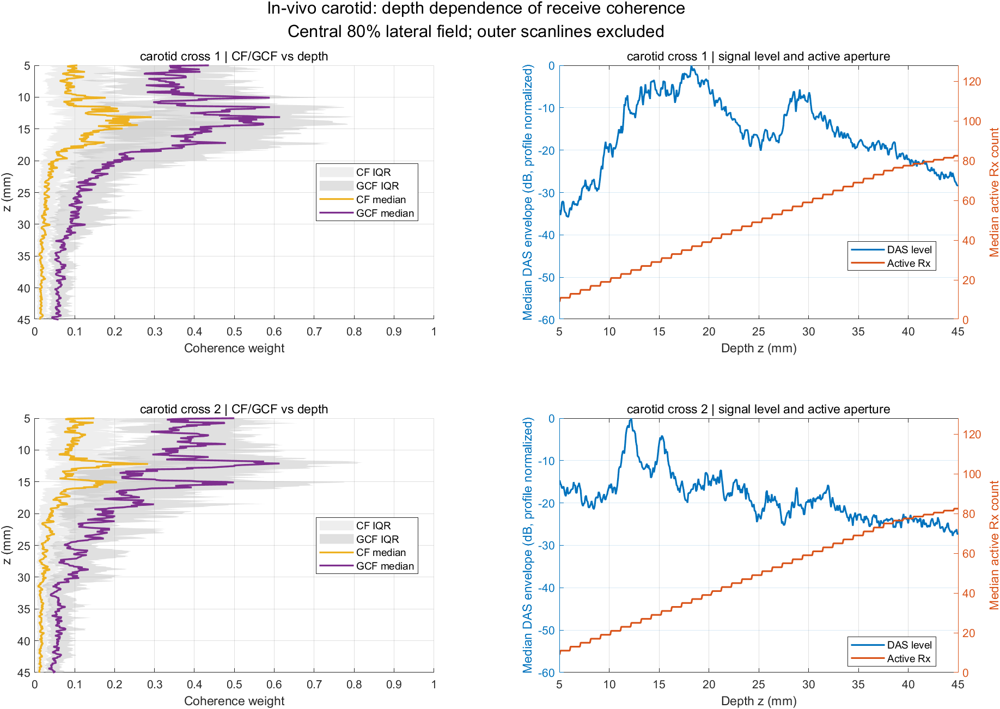

**图 16｜权重下降时，哪些条件也在变化？** 左侧曲线以权重为横轴、深度向下；右侧以深度为横轴，左右 y 轴分别显示 DAS 幅值与有效 Rx 数。两边的坐标组织不同，应先读轴标签。

脚本先在中央 80% scanlines 内按每个深度取 median，再对深度段汇总。下表不是把整段所有像素一次性混合求 median：

| 深度段 | cross 1 CF | cross 1 GCF | cross 2 CF | cross 2 GCF | 有效 Rx 数 median |
|---|---:|---:|---:|---:|---:|
| 5–15 mm | 0.1045 | 0.3799 | 0.0956 | 0.3693 | 19 |
| 15–25 mm | 0.0539 | 0.2102 | 0.0429 | 0.1814 | 39 |
| 25–35 mm | 0.0229 | 0.0905 | 0.0195 | 0.0778 | 59 |
| 35–45 mm | 0.0161 | 0.0597 | 0.0149 | 0.0558 | 77.5 |

两份数据都出现权重随深度下降、有效孔径随深度增大的趋势。后一个条件本身就值得检查。

考虑一个简化基准：等幅、独立均匀随机相位的 $M$ 个通道。对多次随机实现求平均，而非对单次输入强行赋值，有：

$$ \mathbb E[\mathrm{CF}]=\frac{1}{M},\qquad \mathbb E[\mathrm{GCF}]=\frac{L}{M}. $$

$L$ 是纳入分子的独立 bins 数。频带未截断时，`M0=1` 有 $L=3$。当 M 从约 19 增加到约 78，即使保持这种随机相位模型不变，CF 基准也从约 0.053 降到 0.013。

这不是说真实组织就是随机相位，而是说明：**CF/GCF 数值不能脱离 M 和频带直接比较。** 动态孔径还会改变物理空间范围和 GCF 的实际频带。

DAS 包络大小不是通道 SNR。只靠目前的幅值与权重曲线，不能识别或排除噪声、散射、像差、混响等机制。若专门研究深度效应，应增加固定孔径 / 固定 M 和独立 SNR 对照；本章图用于提出问题，不给出唯一原因。

### 15. 验证与复现：明确每个检查回答什么

#### 15.1 当前已经实际检查的内容

| 检查 | 入口 / 证据 | 可以支持什么 |
|---|---|---|
| 真实向量 `sum(s)` 回到第一章 DAS | `inspect_real_cf_aperture_vectors` | 输入向量接回正确计算链 |
| 第二章 DAS 与第一章基线 | `compare_manual_das_vs_cf` | CF 加入时保留原有 DAS |
| CF 与 GCF 核心的 DAS | `compare_manual_das_cf_gcf` | 对照没有悄悄更换基础图像 |
| `GCF(M0=0)=CF` | 同上 | Parseval/DC 关系在实现中成立 |
| 固定输入的 M0 单调性、权重范围与复数乘权 | `export_chapter2_figures` | 数组、权重和输出满足预期数值关系 |

完整实际参数与结果见 [运行记录](figures/matlab_all_results.txt)；修正后的深度图另有 [单项重跑记录](figures/matlab_analyze_carotid_cf_gcf_depth_dependence_results.txt)。

这些是内部一致性与数值检查。当前第二章没有完成独立 USTB CF/GCF 图像 reference 对照，不能把“图像看起来合理”写成已经完成参考复现。

#### 15.2 USTB 参数名相同，不保证 bin 定义相同

本次本地 USTB 固定版本为 `86126eb7cab8b6009d14f2d448e85eeb8a86f61c`。该版本的 [GCF OMHR 源码](https://github.com/unioslo/USTB/blob/86126eb7cab8b6009d14f2d448e85eeb8a86f61c/%2Bpostprocess/generalized_coherence_factor_OMHR.m)对 `M0<=1` 只选 DC，`M0>1` 才选择 ±M0 频带。

因此，本章 `M0=0` 对应 DC-only；本章 `M0=1` 的三个 bins 没有该实现的直接整数参数对应。比较前必须明确统一 bin selection、有效孔径、FFT 长度与其他重建条件，不能只复制参数数字。以上是特定代码版本的约定，不是 GCF 理论要求。

#### 15.3 一次改一个环节，先写下预测

| 想观察的问题 | 修改 / 入口 | 保持一致 |
|---|---|---|
| 频带放宽保留哪些响应？ | `M0_values`、M0 sweep | 数据、DAS、孔径、网格、幅值参考 |
| 有效孔径怎样影响一致性？ | `receive_f_number` | 数据、传播与取样约定 |
| 宽度是否被采样限制？ | `n_z` 与实际 scanline 间距 | 目标、孔径、方法、测量定义 |
| 组织纹理是否被重塑？ | 固定 `roi_corners_mm` | 同一数据、同一 ROI、未裁剪包络 |
| 深度变化来自哪一步？ | 权重、幅值、有效 M 一起画 | 汇总区域、显示基准与频带定义 |

导出全部课件图：

~~~matlab
addpath(genpath('D:/USTB'));
export_chapter2_figures
~~~

也可以只导出一个阶段或脚本：

~~~matlab
export_chapter2_figures('concepts')  % 人工向量，不需 USTB
export_chapter2_figures('phantom')   % TheGB 与目标 / ROI
export_chapter2_figures('carotid')   % 两份人体数据与深度趋势
export_chapter2_figures('experiment_gcf_m0_sweep')
~~~

入口给定像素、目标与 ROI 坐标，适合非交互导出。同名 MATLAB 图和运行记录会更新；AI 插图由内置文生图工具生成，不由 MATLAB 重画。完整复现与分项图片见 [配图索引](figures/README.md)。

## 自测：先能讲主线，再能解释细节

**读完理论后：**

1. 本章单像素的输入为什么是复数 Rx 向量，而不是一张 DAS 灰阶图？
2. `[1,1,1,4]` 都同相，为什么 CF 仍小于 1？
3. CF 的分母为什么有 M？它与孔径 FFT 的 DC 能量怎样相连？
4. GCF 扩大 M0 时，改变的是传播时间、DAS，还是权重判据？
5. 一 bin 相位坡可以有 GCF≈1，为什么加权后仍可能没有输出？

**完成实践后：**

6. 权重图的 0–1 与 B-mode 的 dB 分别代表什么？
7. 一张各自归一化的图，能不能说明目标幅值没有被压低？
8. 同样的 M0，不同有效 M 下对应同样的物理空间频带吗？
9. 横向 FWHM 只跨 1.4 个间隔，应该怎样报告？
10. 深度越大 CF 越低，为什么不能立即归因于 SNR？
11. 当前内部验证和独立 USTB reference 分别需要什么证据？

展开参考思路

1. 权重需要各通道的相位与能量信息，求和或取包络后这些信息无法从单个像素恢复。
2. CF 同时依赖幅值分布；该向量为 49/76。
3. M 使分母成为相干和功率的上界；Parseval 将它转换为全部 FFT 能量。
4. 固定同一输入时，只放宽计入分子的空间频带。
5. 权重没有相位校正能力，仍乘原来相消后的 DAS。
6. 前者是无量纲权重，后者是相对参考幅值的对数显示。
7. 不能；目标增益变化应在共同参考下另行报告。
8. 不一定，空间频率为 k/(M·pitch)。
9. 报告网格间距和采样支撑，把数值视为粗估。
10. 有效 M、实际频带和其他传播 / 散射条件也在变化；DAS 包络不是独立 SNR。
11. 前者检查共享路径和恒等关系；后者还需独立实现、明确定义与匹配条件。

## 术语回查与课件讲解顺序

| 术语 | 本章的含义 |
|---|---|
| aligned aperture vector | 当前像素、当前 Tx 的有效复数 Rx 样本 |
| phasor | 用箭头表示复数幅值与相位 |
| coherent sum | 保留相位的通道求和 |
| channel energy | 各通道幅值平方之和 |
| aperture spectrum | 沿接收阵元方向的离散空间频谱 |
| DC | 零空间频率，所有通道相同的常量分量 |
| M / M0 | 有效 Rx 数 / 低空间频率半宽 bins |
| CF / GCF map | 逐像素权重图，不是 B-mode |
| common / self reference | 共同幅值参考 / 各自峰值参考 |
| point-like profile | 真实点状回波的剖面，未必等于理想 PSF |

建议分三轮授课：

| 轮次 | 图与主线 | 学生应能说清 |
|---|---|---|
| 第一轮：完整理论 | 图 1 → 2 → 3 → 4 → 5 | 输入、CF、乘权流程、空间频谱、GCF |
| 第二轮：公式落地 | 图 6 → 7 → 8 → 9 → 10 | 人工向量、真实向量、整张加权图 |
| 第三轮：任务与边界 | 图 11–16 | M0 取舍、目标采样、组织纹理、深度混杂因素 |

课时较少时，先完成前两轮；目标、ROI 与人体图用于进一步讨论。每组 MATLAB 图的运行入口、网格和显示基准都可在 [完整图册](figures/README.md)回查。

## 延伸阅读与下一章

- [Mallart 与 Fink，1994](https://doi.org/10.1121/1.410562)：聚焦准则、散射介质与声速不均匀背景。本章不把历史问题简化成“CF 最初就是为了让图更黑”。
- [Li 与 Li，2003：Adaptive imaging using the generalized coherence factor](https://pubmed.ncbi.nlm.nih.gov/12625586/)：GCF 的低空间频率能量比例与 DC-only 退化关系；DOI `10.1109/TUFFC.2003.1182117`。
- [USTB 固定版本的 CF 源码](https://github.com/unioslo/USTB/blob/86126eb7cab8b6009d14f2d448e85eeb8a86f61c/%2Bpostprocess/coherence_factor.m)：公式、乘权与历史引用。
- [USTB 固定版本的 GCF OMHR 源码](https://github.com/unioslo/USTB/blob/86126eb7cab8b6009d14f2d448e85eeb8a86f61c/%2Bpostprocess/generalized_coherence_factor_OMHR.m)：特定实现的参数与频带约定。

本章的手写核心面向二维线性阵列、正深度 spherical FI、实数 RF 和二值接收孔径，未包含跨 Tx coherence、基带 IQ 处理或运动补偿。

下一章进入 **MV / MVDR / Capon**。本章先沿 Rx 作 DAS，再乘一个逐像素权重；下一章会从对齐后的通道数据估计协方差，进一步决定各接收通道的自适应组合权重。
